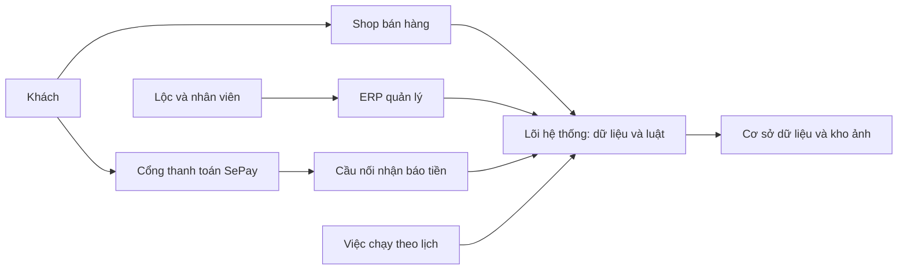
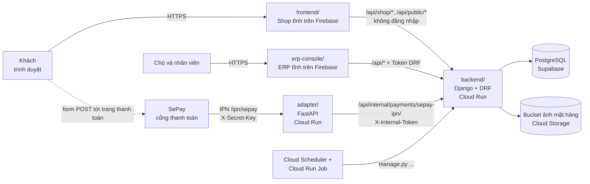

# Tổng quan hệ thống

> Cập nhật 02/10/2026, theo code `main` `bf62b81`.



## Hệ thống làm gì

**Cá Về** là phần mềm cho một vựa hải sản đông lạnh bán lẻ cho khách cá nhân (B2C). Lộc là chủ vựa, Duy là PO.
Vựa mua cá theo **lô** tại cảng, bán online theo kg, giao tận nhà bằng nhân viên của vựa, và theo dõi **giá vốn, lãi lỗ theo từng lô**.

Bốn việc lớn:
1. **Mua và nhập kho**: ghi phiếu nhập tại cảng, mỗi dòng sinh một lô, cộng chi phí phụ vào giá vốn lô.
2. **Bán online**: khách đặt trên Shop không cần tài khoản, hệ thống giữ chỗ hàng theo lô, khách trả tiền bằng VietQR qua cổng SePay.
3. **Vận hành**: gọi xác nhận đơn, soạn hàng, in tem, giao hàng, xử lý giao thất bại, huỷ đơn, hoàn tiền, kiểm kê.
4. **Báo cáo**: lãi lỗ theo lô (nguồn sự thật) và theo tháng, bảng điều hành.

Ngoài ra có CMS viết bài và trang chính sách cho Shop, và lớp **AI Native** (lệnh nghiệp vụ AI gọi được, có phân quyền và chính sách của Chủ).

## Bốn bề mặt

| Thư mục | Là gì | Ai dùng | Công nghệ | Chạy ở đâu |
|---|---|---|---|---|
| `backend/` | **Lõi duy nhất**: dữ liệu, nghiệp vụ, API, Django Admin | ERP, Shop, adapter gọi vào | Django 5 + Django REST Framework, PostgreSQL | Cloud Run `cangca-api` / `cangca-api-staging` |
| `erp-console/` | ERP nội bộ (console vận hành) | Chủ, Quản lý, NV kho, NV giao, CSKH | Next.js 14, xuất tĩnh | Firebase Hosting site `cangca-erp` / `cangca-erp-staging` |
| `frontend/` | Shop và trang giới thiệu cho khách | Khách (không đăng nhập) | Next.js 14, xuất tĩnh | Firebase Hosting site `cangca-loc` / `cangca-loc-staging` |
| `adapter/` | Lớp mỏng nhận IPN thanh toán từ SePay rồi chuyển vào Django | SePay gọi vào | FastAPI, không đụng DB | Cloud Run `cangca-adapter` / `cangca-adapter-staging` |

Chuỗi `cangca` trong tên hạ tầng là tên cũ, không phải thương hiệu. Thương hiệu hiển thị là "Cá Về".

## Sơ đồ kiến trúc



Bản ASCII rút gọn:

```
Khách ──► Shop (frontend/, tĩnh) ──┐                      ┌──► PostgreSQL (Supabase)
                                    ├──► Django API ───────┤
Nhân viên ──► ERP (erp-console/) ──┘    (backend/)         └──► Bucket ảnh (GCS)
                                          ▲
SePay ──IPN──► adapter/ (FastAPI) ────────┘   (adapter không đụng DB)
Cloud Scheduler ──► Cloud Run Job ──► manage.py <job>
```

Nguyên tắc kiến trúc (decisions.md 2026-09-09, 2026-09-10):
- **Django là 100% lõi.** Mọi luật nghiệp vụ nằm ở `backend/apps/<app>/<module>/services.py`. View API chỉ kiểm quyền, gọi service, trả JSON.
- **Adapter chỉ chuyển tiếp.** Bên thứ ba không nối thẳng vào lõi. Adapter xác thực, đổi dạng dữ liệu, gọi API nội bộ. Chống trùng giao dịch do Django lo.
- **Shop và ERP là web tĩnh.** Không có server Next.js khi chạy. Mọi dữ liệu lấy qua API lúc chạy trên trình duyệt, nên URL API phải truyền vào **lúc build**.
- **Không xây trên Frappe/ERPNext.** Chỉ mượn cách đặt tên chứng từ (`doc/doctype-mapping.md`).

## Môi trường

Chi tiết đầy đủ (URL, tên secret, lệnh deploy, nhật ký deploy) ở `doc/ops/moi-truong.md`. Tóm tắt:

| | Staging (thử) | Production (thật) |
|---|---|---|
| Mục đích | QA và Duy thử, dữ liệu giả | Dữ liệu thật |
| Backend | Cloud Run `cangca-api-staging` | Cloud Run `cangca-api` |
| Adapter | `cangca-adapter-staging` | `cangca-adapter` |
| Shop / ERP | site `cangca-loc-staging` / `cangca-erp-staging` (có header `noindex`) | site `cangca-loc` / `cangca-erp` |
| Database | Supabase, database `cangca_staging` | Supabase, database `postgres` |
| SePay | Sandbox | Live |
| Job nền | Cloud Run Job `cangca-migrate-staging`; job khác thêm khi cần | `cangca-ttl`, `cangca-batch-status`, `cangca-migrate` |

Trạng thái tại ngày cập nhật (theo `doc/ops/moi-truong.md`):
- **Production đang tắt** để tiết kiệm (ingress internal, scheduler tạm dừng). Chỉ staging chạy.
- **Cổng SePay live đang tắt** trên dashboard SePay cho tới khi đủ checklist `doc/ops/go-live-phap-ly.md`.
- AI tắt trên staging (`AI_ENABLED` chưa đặt).

Quy tắc chung:
- Deploy staging trước. Duy duyệt rồi mới lên production, dùng **cùng image**.
- Có migration thì chạy trên staging trước.
- Đổi biến môi trường và secret trong **một lệnh** `gcloud run services update`, để không sinh revision trung gian thiếu DB.
- Secret nằm trong GCP Secret Manager. Không có trong repo.
- GCP project `keolai-63ec1`, region `asia-southeast1`.

## Thời gian và tiền

- DB lưu giờ UTC. Hiển thị luôn theo giờ Việt Nam (`Asia/Ho_Chi_Minh`). Backend đặt `TIME_ZONE = "Asia/Ho_Chi_Minh"` và dùng `timezone.localtime(...)`. ERP và Shop dùng hàm trong `shared/lib/format.ts` / `lib/format.ts` (ví dụ `todayInVietnam()`), không dùng giờ máy người xem.
- Tiền là VNĐ, kiểu `Decimal` ở backend, không dùng float. Tổng đơn làm tròn về nguyên đồng (BR-BH-15).
- Khối lượng tính theo kg.
