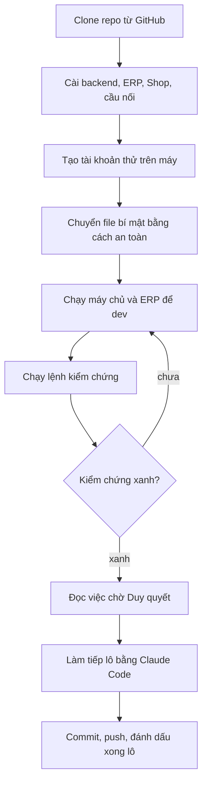

# Bàn giao sang máy mới — dev tiếp dự án Cá Về
> Viết 02/10/2026 sau đợt "ERP theo design" chạy qua đêm. Đọc file này từ trên xuống, làm đúng thứ tự.
> Mọi thứ cần để dev tiếp **đều ở trên GitHub** (`DuyduyFedev46/fish`, nhánh `main`) — trừ các file bí mật ở §2.



## 0. Trạng thái lúc bàn giao
- Nhánh duy nhất cần dùng: **`main`** (commit cuối lúc bàn giao: xem `git log -1`). Các nhánh tạm `ed-stream-b/c` đã gộp và xoá; worktree tạm đã gỡ.
- Tính năng đang làm: **ERP theo design** — hồ sơ ở `doc/features/2026-10-01-erp-theo-design/`.
  - Tiến độ từng lô: `02c-giao-viec.md` (☑ = xong, đã QA + push; ☐ = còn lại).
  - **Đã xong 11/17 lô** (☑ Lô 1–11). Phần **backend của mọi lô đã xong**. Còn lại FE: **12** Kế toán, **13** Danh mục & giá, **14** Nhân sự + Phân quyền, **15** Tổng quan + màn AI + Nhật ký + Tài khoản, **16** Nội dung, **17** dọn dẹp + ⌘K + thanh AI danh sách + hồi quy toàn bộ.
  - Số kiểm lúc bàn giao: backend 2694 test OK · ERP vitest 717 · e2e các lô 1–11 xanh.
  - **Việc chờ Duy quyết + nợ chuyển lô sau:** `00-can-duy-quyet.md` (đọc trước khi làm lô mới — nhiều nợ ghi rõ "Lô 17", "Lô 15"…).
  - Ghi chú dev / review / QA từng lô: `03-dev-notes.md`, `03b-review-techlead.md`, `04-qa-report.md`.
- **Chưa deploy** bản nào của đợt này lên staging/production. Không deploy bản chưa có Lô 2 FE (đã có) — xem điểm dừng trong 02c.
- Tài liệu hệ thống (kiến trúc, nghiệp vụ, backend, ERP, Shop, quy trình đội, thuật ngữ): `doc/he-thong/`.

## 1. Cài đặt máy mới
Cần: **git**, **Python 3.11**, **Node 20+** (máy cũ dùng Node 24), **Claude Code**, trình duyệt Chromium cho Playwright.

```bash
git clone https://github.com/DuyduyFedev46/fish.git loc
cd loc

# Backend (Django)
cd backend
python3.11 -m venv .venv
.venv/bin/pip install -r requirements.txt
cp .env.example .env            # dev: để trống DATABASE_URL → dùng SQLite; DJANGO_DEBUG=1
.venv/bin/python manage.py migrate
.venv/bin/python manage.py bootstrap_masterdata   # nhóm quyền, kho, bảng giá…
.venv/bin/python manage.py seed_demo              # dữ liệu mẫu (lô, đơn) — dữ liệu GIẢ
cd ..

# ERP (erp-console)
cd erp-console && npm ci && cd ..
# Shop (frontend)
cd frontend && npm ci && cd ..
# Adapter (FastAPI, webhook SePay)
cd adapter && python3.11 -m venv .venv && .venv/bin/pip install -r requirements.txt -r requirements-dev.txt && cd ..

# Playwright cho e2e (Python)
python3 -m pip install playwright && python3 -m playwright install chromium
```

**Tài khoản dev để đăng nhập ERP với backend thật** (chỉ ở máy local, dữ liệu giả):
```bash
cd backend && .venv/bin/python manage.py shell -c "
from django.contrib.auth.models import User, Group
for name, group in [('loc','owner'),('ql1','manager'),('kho1','warehouse_staff'),('giao1','delivery_staff'),('cs2','customer_service')]:
    u, _ = User.objects.get_or_create(username=name)
    u.set_password('demo1234'); u.save(); u.groups.set([Group.objects.get(name=group)])
"
```
(Tài khoản có thể bị bắt đổi mật khẩu lần đầu — xem `doc/he-thong/backend.md`.)

## 2. File bí mật — KHÔNG có trong repo, phải tự chuyển
Repo công khai, các file sau bị `.gitignore` chặn. Chuyển bằng cách an toàn (USB mã hoá, trình quản lý mật khẩu, GCP Secret Manager) — **không** gửi qua chat/email, **không** commit:

| File (máy cũ) | Dùng cho | Ghi chú |
|---|---|---|
| `sepay.env` (gốc repo) | khoá SePay sandbox | Giá trị gốc nằm ở GCP Secret Manager (`cangca-sepay-*`) |
| `supabase.env` (gốc repo) | chuỗi kết nối DB staging/production | Chỉ cần khi chạy lệnh trên DB thật / deploy |
| `backend/.env` | cấu hình Django local | Có thể tạo mới từ `.env.example` |
| `frontend/.env.local`, `frontend/.env.production`, `erp-console/.env.production` | URL API khi build | Build deploy luôn truyền `NEXT_PUBLIC_*` trực tiếp (xem `doc/ops/moi-truong.md`) |

Đăng nhập GCP/Firebase để deploy: `gcloud auth login`, `firebase login` (project trong `doc/ops/moi-truong.md`). Chỉ deploy khi Duy bảo.

## 3. Chạy để dev
```bash
# API
cd backend && .venv/bin/python manage.py runserver 8000

# ERP chế độ mock (không cần backend) — nhanh nhất để làm giao diện
cd erp-console && NEXT_PUBLIC_USE_MOCK=1 npm run dev        # http://localhost:3000 — tài khoản mock: loc / ql1 / kho1 / giao1 / cs2

# ERP nối backend thật
cd erp-console && NEXT_PUBLIC_USE_MOCK=0 NEXT_PUBLIC_API_BASE=http://localhost:8000 npm run dev
```

## 4. Lệnh kiểm chứng (chạy trước khi báo "xong")
```bash
# Backend
cd backend && .venv/bin/python manage.py makemigrations --check --dry-run && .venv/bin/python manage.py test   # lúc bàn giao: ~2672 test OK
python3 scripts/check_naming.py                                     # luật tên tiếng Anh (từ gốc repo)

# ERP
cd erp-console && npx tsc --noEmit && npx vitest run
NEXT_PUBLIC_USE_MOCK=0 npm run build && node scripts/check-no-mock.mjs && node scripts/check-ai-chunks.mjs
NEXT_PUBLIC_USE_MOCK=1 npm run build && (cd out && python3 -m http.server 3101 &)
BASE=http://127.0.0.1:3101 python3 e2e/ed_batch1_shell.py   # … các e2e ed_batch<N>_*.py của từng lô
pkill -f "http.server 3101"
```
Các script e2e chạy trên backend thật (`*_real.py`, `qa_*_real.py`) cần Django + SQLite tạm + seed — cách dựng ghi trong `03-dev-notes.md` / `04-qa-report.md` của lô tương ứng.

## 5. Làm tiếp bằng Claude Code
- Mở Claude Code ở thư mục `loc/`. `CLAUDE.md` + `.claude/` (agents, skills, commands) **đã có trong repo** nên đội agent (ba-analyst, po-owner, techlead, be-dev, fe-dev, qa-tester, legal-vn) dùng được ngay.
- Làm tiếp các lô ERP: gõ **`/lam-design-erp`** — nó lấy lô ☐ đầu tiên trong 02c và chạy quy trình dev → techlead review → QA → commit + push → ☑.
- Trước đó nên báo Claude đọc `00-can-duy-quyet.md` (nợ chuyển lô) và trả lời các mục Duy đã quyết.
- Việc khác: nói bằng lời thường, Claude tự gọi skill `feature` (xem `CLAUDE.md`).

**Bộ nhớ của Claude** (sở thích, quy ước Duy đã dặn) nằm ở máy cũ: `~/.claude/projects/-Users-dangthiduyen-Downloads-loc/memory/` — **không** theo repo. Muốn giữ: chép cả thư mục `memory/` sang máy mới đúng đường dẫn tương ứng với thư mục clone (tên thư mục project = đường dẫn tuyệt đối thay `/` bằng `-`). Nếu không chép, các quy ước chính vẫn có trong `CLAUDE.md` và `doc/`.

## 6. Quy ước cần giữ (tóm tắt — chi tiết `CLAUDE.md`)
- Mỗi lô xong (QA APPROVED) → commit tiếng Việt có mã lô/story → `git push origin main` → ☑ trong 02c.
- **Commit bằng pathspec** khi nhiều agent cùng sửa (`git commit -- <path>` hoặc kiểm `git diff --cached --name-only` trước) — đã có sự cố commit cuốn nhầm file đang stage của lô khác.
- Không commit `.env`/bí mật; không rò giá vốn; không rò dữ liệu cá nhân khách (lỗi Critical); không xoá chứng từ; không sửa `doc/decisions.md`; không deploy khi Duy chưa bảo.
- Tiền VNĐ hiển thị "đ", giờ Asia/Ho_Chi_Minh `dd/mm/yyyy hh:mm`; định danh code tiếng Anh, giao diện tiếng Việt.
- Chạy song song nhiều lô FE: mỗi luồng một `git worktree` riêng + cổng riêng (3101/3201/3301…), vì `npm run build` ghi đè `out/`.
