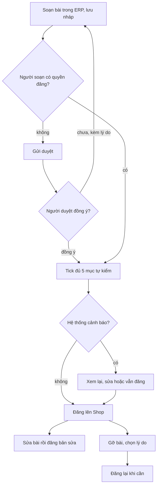

# CMS Cá Về: hướng dẫn thực hành cho người soạn nội dung (MKT)

> Viết ngày 10/10/2026 bởi `mkt-brand`. Tài liệu được rút ra từ code ở nhánh `shop/lo-0-quyet-dinh`. Mỗi luật có ghi nguồn dạng `file:dòng`.
> Đường dẫn gốc là `backend/apps/content/` (viết tắt `content/`) và `erp-console/features/content/` (viết tắt `erp/content/`).
> Các luật BR-ND-01…17 **không nằm trong** `doc/business-process-spec.md`. Chúng chỉ có trong hồ sơ
> `doc/features/2026-09-28-cms-viet-bai/01-analysis.md:236-252`. Đây là điểm cần BA chép về spec gốc.
> Theo quyết định `doc/decisions.md:252` (10/10): mọi nội dung chữ do Lộc sửa được thì để ở CMS, còn chữ giao diện (nút, câu lỗi, tiêu đề màn) để trong code.



---

## 1. CMS ở đâu, ai được dùng

- **Màn soạn:** ERP → **Nội dung**. Có ba trang: danh sách `erp-console/app/(console)/content/page.tsx`, soạn bài `…/content/edit/page.tsx` và chuyên mục `…/content/categories/page.tsx`.
- **Quyền:** app có 8 quyền (`content/permissions.py:7-25`). Migration `content/migrations/0002_grant_content_perms.py:7-17` gán đủ 8 quyền cho nhóm **Chủ** và **Quản lý**. Hai nhóm NV kho và NV giao không có quyền nào (`content/README.md:12-16`).

| Việc | Quyền cần | Nguồn |
|---|---|---|
| Xem danh sách, lịch sử phiên bản | `content.view_entry` | `content/entries/api.py:213,225-229` |
| Tạo nháp, lưu nháp, gửi duyệt, huỷ thay đổi, khôi phục phiên bản | `content.add_entry` / `content.change_entry` | `entries/api.py:145-170,244-248` |
| Xoá nháp chưa từng đăng | `content.delete_entry` | `entries/api.py:87-91` |
| **Đăng, đăng lại, gỡ, trả về nháp**. Đặt vai trò trang (`page_role`), bật hiện ở chân trang, thứ tự chân trang | `content.publish_entry` | `entries/api.py:93,126,194`; `entries/services.py:83-90` |
| Tạo, sửa chuyên mục | `content.add_category` / `content.change_category` | `permissions.py:8-9` |

- **Hệ quả thực tế:** hiện chỉ Chủ và Quản lý có quyền, và cả hai đều có quyền **đăng**. Nhánh "Gửi duyệt → Chờ duyệt" (`erp/content/contentModel.ts:324-331`) chỉ dùng tới khi có người được **sửa mà không được đăng**. Hiện chưa nhóm nào ở dạng đó.
- **MKT chưa có chỗ đăng nhập riêng.** Từ 08/10, người không thuộc nhóm nào thì không vào được ERP (`doc/decisions.md:219`). Nếu cho MKT vào nhóm Quản lý thì MKT có thêm rất nhiều quyền vận hành khác. Đây là câu cần Duy quyết: có tạo nhóm "Biên tập nội dung" hay không (xem §11).

## 2. CMS chứa được những gì

### 2.1 Hai loại nội dung (`Entry.kind`)

| | **Bài viết** (`post`) | **Trang** (`page`) |
|---|---|---|
| Dùng cho | Góc bếp: mẹo rã đông, công thức, tin mùa vụ | Chính sách, Liên hệ, Cách mua hàng, Giới thiệu |
| Địa chỉ trên Shop | `/bai-viet/?slug=<đường dẫn>` | `/trang/?slug=<đường dẫn>` (`entries/services.py:549`) |
| Chuyên mục | **Bắt buộc** khi đăng | Không có |
| Ảnh bìa | **Bắt buộc** khi đăng, và phải có mô tả ảnh | Không bắt buộc |
| Vào danh sách bài | Có (`?kind=post`) | Không (lấy theo đường dẫn, theo vai trò hoặc từ chân trang) |
| Đổi loại sau khi đã đăng | Không được (`entries/services.py:199-200`) | Không được |

Nguồn: `content/models/entries.py:11`; `entries/services.py:302-335`.

### 2.2 Các trường của một bài hoặc trang

| Trường (nhãn ở ERP) | Giới hạn | Bắt buộc khi đăng | Nguồn |
|---|---|---|---|
| Tiêu đề | ≤ 200 ký tự, quá thì báo lỗi | Có | `entries/services.py:92-97`, `settings.py:315` |
| Đường dẫn (slug) | Tự sinh từ tiêu đề: bỏ dấu, chữ thường, nối bằng `-`, tối đa 100 ký tự. Phải duy nhất trên mọi nội dung, kể cả bài đã gỡ. Trùng thì hệ thống gợi ý `…-2`. **Khoá sau lần đăng đầu** | Có | `body/slug.py:19-49`; `entries/services.py:118-160` |
| Tóm tắt (`excerpt`) | **Tự cắt ở 500 ký tự, không báo** | Cần có tóm tắt **hoặc** mô tả tìm kiếm | `entries/services.py:192`, `:328-333` |
| Tiêu đề khi tìm kiếm (`seo_title`) | Tự cắt ở 200 ký tự. Nên viết ≤ 60 ký tự | Không | `entries/services.py:193` |
| Mô tả khi tìm kiếm (`seo_description`) | Tự cắt ở 300 ký tự. Web chỉ dùng **160 ký tự đầu** | (xem Tóm tắt) | `entries/services.py:194,338-360`; `settings.py:316` |
| Chuyên mục | Chỉ chọn chuyên mục đang dùng | Bài viết: có | `entries/services.py:320-322` |
| Ảnh bìa + mô tả ảnh | Phải là ảnh đã tải vào **chính bài này** | Bài viết: có | `entries/services.py:162-177,323-326` |
| Thân bài | Xem §3 | Có, ít nhất 1 khối | `entries/services.py:315-318` |
| Vai trò trang (`page_role`) | Chỉ trang. Xem §2.3 | — | `models/entries.py:18-23,48` |
| Hiện ở chân trang + thứ tự | Chỉ người có quyền đăng mới đặt được | — | `models/entries.py:49-50`; `entries/services.py:83-90` |

- **Mô tả công khai** (dùng cho thẻ meta và ảnh xem trước khi chia sẻ): lấy `seo_description` nếu có. Nếu không thì lấy tóm tắt, cắt ở khoảng trắng gần nhất trước ký tự 160 và bỏ dấu câu treo (`entries/services.py:338-360`).
- **Tác giả** hiện trên web luôn là "Cá Về", không bao giờ là tên nhân viên (`public/serializers.py:115`; BR-ND-14).

### 2.3 Vai trò trang (`page_role`): 4 trang bắt buộc trước khi mở bán

| Mã | Tên | Nguồn |
|---|---|---|
| `privacy` | Chính sách bảo mật | `models/entries.py:19` |
| `terms` | Điều kiện giao dịch chung (tên Duy chốt 07/10, `doc/decisions.md:212`) | `:20` |
| `refund` | Chính sách đổi trả và hoàn tiền | `:21` |
| `seller_info` | Thông tin người bán | `:22` |

Luật đi kèm:
- Mỗi vai trò chỉ gán cho **một** trang (`models/entries.py:65-67`; `entries/services.py:221-226`).
- Trang đang đăng mà giữ vai trò thì **không gỡ được** và **không đổi hay bỏ vai trò được**. Muốn đổi nội dung thì sửa rồi đăng lại (`entries/services.py:229-234,816-820`; BR-ND-16).
- Mỗi lần đăng tạo ra một phiên bản có ngày hiệu lực. Shop dùng phiên bản này để biết khách đã đồng ý **bản chính sách nào** khi đặt hàng (`public/api.py:184-221`).
- ERP báo "Còn thiếu trang bắt buộc trước khi mở bán" nếu một trong 4 vai trò chưa có trang đã đăng (`entries/services.py:956-965`; `entries/api.py:287-301`; `erp/content/messages.ts:37`).
- **Chỉ có 4 vai trò này.** Thiết kế Shop có 6 chính sách. Ba trang còn lại là Giao hàng, Thanh toán và Khiếu nại. Chúng chỉ là trang thường: gỡ được và không được khoá như trang bắt buộc (xem §10).

### 2.4 Chân trang (footer)

- Trang nào bật "Hiện ở chân trang" và **đang đăng** thì vào danh sách link chân trang, xếp theo "Thứ tự chân trang" (`public/api.py:224-249`).
- API trả về **một danh sách phẳng** gồm tiêu đề và đường dẫn. Danh sách **không chia nhóm** (Mua hàng / Chính sách / Về Cá Về), cũng không chứa link ngoài CMS như Tra cứu đơn hay Hàng đang có.

### 2.5 Chuyên mục (chỉ dùng cho bài viết)

- Mỗi chuyên mục có tên (≤ 80 ký tự), mô tả ngắn (≤ 300 ký tự) và thứ tự hiển thị (`models/categories.py:7-12`).
- Tên không được trùng. Hệ thống so tên sau khi bỏ dấu và chữ hoa, nên "Món hấp" trùng với "mon hap" (`categories/services.py:14-16`).
- Đường dẫn được sinh một lần từ tên và **giữ nguyên khi đổi tên** (`categories/services.py:18-23,46`). Trên Shop, chuyên mục hiện thành `/bai-viet/?chuyen-muc=<đường dẫn>`.
- Không xoá được chuyên mục, chỉ **ngừng dùng**. Nếu chuyên mục còn bài đang đăng thì hệ thống chặn (`models/categories.py:18`; `categories/services.py:54-75`).
- Trên Shop, chuyên mục chỉ hiện khi đang dùng **và** có ít nhất 1 bài đã đăng (`public/api.py:172-181`).

### 2.6 Ảnh

| Luật | Giá trị | Nguồn |
|---|---|---|
| Định dạng | JPEG, PNG, WebP. Không nhận SVG. Hệ thống kiểm cả nội dung thật của tệp | BR-ND-07 → BR-DM-10 |
| Dung lượng | ≤ 10 MB mỗi ảnh | `images/services.py:20-23`; `settings.py:161` |
| Xử lý | Giữ tỉ lệ gốc, không cắt vuông. Gỡ EXIF và GPS. Xuất 3 cỡ WebP rộng 480, 960 và 1600 px | `images/services.py:52-57`; `settings.py:331` |
| Số ảnh **đang dùng** trong một bài (gồm cả ảnh bìa) | ≤ 20 | `images/services.py:30-41`; `body/sanitize.py:198-199` |
| Tổng số lần tải ảnh lên một bài | ≤ 100 | `images/services.py:25-28` |
| Khi nào tải được | Chỉ sau khi đã **Lưu nháp lần đầu** | `body/sanitize.py:15-16,172-174`; `erp/content/messages.ts:196` |
| Ảnh của bài khác | Không dùng được, kể cả làm ảnh bìa | `body/sanitize.py:177-178`; `entries/services.py:388-398` |
| Mô tả ảnh (alt) | ≤ 200 ký tự. Để trống thì hệ thống lấy tiêu đề bài, nếu vẫn trống thì ghi "Ảnh minh hoạ bài viết". **Nên tự viết** | `images/services.py:70-75,88-92` |

## 3. Thân bài: các khối được phép

Thân bài lưu dạng JSON `{"type":"doc","blocks":[…]}`. Danh sách trắng được kiểm **hai lần**: một lần khi lưu và một lần nữa khi Shop đọc ra (`body/sanitize.py:97-201`; `public/serializers.py:30-75`; BR-ND-06).

| Khối | Nút trên thanh công cụ ERP | Giới hạn | Nguồn |
|---|---|---|---|
| `heading` | "H2 Tiêu đề mục", "H3 Tiêu đề phụ" | Chỉ cấp 2 và 3. Cấp khác bị đổi thành 2. Chỉ là chữ thường, không đậm hay nghiêng | `sanitize.py:140-145`; `erp/content/editor/TiptapEditor.tsx:124-125` |
| `paragraph` | (gõ bình thường) | Chữ có thể **đậm** hoặc *nghiêng*, có thể gắn liên kết | `sanitize.py:147-150` |
| `list` | "Danh sách chấm", "Danh sách số" | ≤ 100 mục mỗi danh sách. Mục sau thứ 100 bị bỏ | `sanitize.py:152-162` |
| `quote` | "Trích dẫn" | Giống đoạn văn | `sanitize.py:147-150` |
| `image` | (Ảnh trong bài → Chèn vào bài) | Mô tả ảnh ≤ 200 ký tự, chú thích ≤ 300 ký tự | `sanitize.py:164-181` |
| `item_card` | "Mặt hàng" | Mã hàng phải có thật trong danh mục. Shop tự lấy tên, ảnh, giá **lúc khách xem** và trạng thái còn hàng | `sanitize.py:183-193`; BR-ND-10 |

- **Định dạng chữ** chỉ có `bold` và `italic` (`sanitize.py:12`).
- **Liên kết** chỉ nhận `https:`, `http:`, `mailto:`, `tel:` hoặc đường dẫn nội bộ bắt đầu bằng `/`. Đường dẫn bắt đầu bằng `//` bị loại. Tối đa 2000 ký tự, không chứa khoảng trắng (`sanitize.py:14,26-52`). Link không hợp lệ bị **bỏ âm thầm**: chữ vẫn còn nhưng mất link.
- **Toàn bài:** ≤ 300 khối và ≤ 60.000 ký tự chữ. Vượt thì không lưu được (`sanitize.py:115-117,195-196`; `settings.py:332-333`).
- **Bị bỏ khi lưu:** HTML, script, iframe, video nhúng, bảng, form, nút, mục thu gọn (accordion), màu chữ, căn lề, ảnh dán link ngoài, cùng mọi khối khác ngoài 6 loại trên (`sanitize.py:136-138`).
- **Liên kết từ bài sang Shop** gắn UTM `utm_source=caveve_web&utm_medium=bai_viet&utm_campaign=<đường dẫn bài>`. Link dán lên mạng xã hội dùng `utm_source=facebook|zalo|tiktok&utm_medium=social`. Không bao giờ đưa dữ liệu khách vào UTM (BR-ND-09). Liên kết ngoài mở tab mới và có `nofollow` (BR-ND-08).

## 4. Quy trình soạn → duyệt → đăng → gỡ

```
Nháp ──Gửi duyệt──► Chờ duyệt ──Đăng──► Đã đăng ──Gỡ──► Đã gỡ
  ▲                    │                  │  ▲              │
  └────Trả về nháp─────┘                  │  └──Đăng lại────┘
       (kèm lý do)          sửa ▶ "Đăng bản sửa" / "Huỷ thay đổi"
```
Nguồn: `models/entries.py:12-17`; `entries/services.py:401-918`.

| Bước | Ai | Điều kiện / điều xảy ra | Nguồn |
|---|---|---|---|
| **Lưu nháp** | Có quyền sửa | Không ghi nhật ký. Nếu chưa lưu lên máy chủ được, ERP giữ bản nháp trên máy. Hai người cùng sửa một bài thì người lưu sau bị báo "Xung đột phiên bản" | `entries/services.py:68-288`; `erp/content/messages.ts:100-108` |
| **Gửi duyệt** | Có quyền sửa, bài đang **Nháp** | Phải đủ trường bắt buộc (§2.2). Nếu có cảnh báo thì phải bấm "Đã kiểm tra, vẫn gửi duyệt" | `entries/services.py:563-645` |
| **Trả về nháp** | Có quyền đăng, bài đang **Chờ duyệt** | Chọn một lý do: Thiếu thông tin hoặc hình ảnh · Nội dung chưa chuẩn · Rủi ro pháp lý hoặc bản quyền · Lý do khác | `entries/services.py:560,648-717`; `erp-console/shared/lib/enums.ts:254-259` |
| **Đăng** | Có quyền đăng | Đủ trường bắt buộc. Tick đủ **5 mục tự kiểm** (giá và mặt hàng đúng với Shop · ảnh bìa có mô tả · không có SĐT hay tài khoản của khách · không cam kết sai về chất lượng · đã đọc lại chính tả). Xác nhận cảnh báo nếu có. Mỗi lần đăng tạo một **phiên bản** không sửa, không xoá được, và ghi đúng 1 dòng nhật ký (không chép thân bài) | `entries/services.py:401-557`; `erp/content/messages.ts:207-215`; `models/entries.py:83-130` |
| **Sửa bài đã đăng** | Có quyền sửa | Web vẫn hiện bản cũ cho tới khi bấm **"Đăng bản sửa"**. Không có gì thay đổi thì báo "Không có thay đổi để đăng". "Huỷ thay đổi" đưa bài về đúng bản đang hiện trên web | `entries/services.py:436-442,863-918` |
| **Khôi phục phiên bản** | Có quyền sửa | Chép nội dung bản cũ vào bản đang soạn, **chưa** lên web. Lên web khi đăng lại, và nhật ký ghi là "khôi phục" | `entries/services.py:720-781` |
| **Gỡ** | Có quyền đăng, bài đang **Đã đăng**, **không** giữ vai trò trang bắt buộc | Chọn một lý do: Giá chưa đúng · Khiếu nại hoặc rủi ro pháp lý · Hết mùa vụ · Nội dung chưa chuẩn · Lý do khác. Sau khi gỡ, Shop trả **410 "Bài này không còn trên web."** | `entries/services.py:784-860`; `enums.ts:260-266`; `public/api.py:139-146` |
| **Xoá** | Có quyền xoá | Chỉ xoá được nháp **chưa từng đăng**. Xoá luôn ảnh của bài. Bài đã từng đăng thì chỉ gỡ được | `entries/services.py:291-299`; BR-ND-02 |

## 5. Bị chặn và bị cảnh báo

**Bị chặn** (không lưu hoặc không đăng được):
- Thiếu trường bắt buộc. ERP liệt kê "Còn thiếu: …" (`entries/services.py:302-335,447-454`; `messages.ts:280-288`).
- Chưa tick đủ danh sách tự kiểm (`entries/services.py:457-461`).
- Tiêu đề quá 200 ký tự, thân bài quá 300 khối hoặc 60.000 ký tự, bài dùng quá 20 ảnh, ảnh quá 10 MB.
- Đường dẫn trùng, hoặc đổi đường dẫn sau khi đã đăng.
- Ảnh không thuộc bài. Thẻ mặt hàng có mã hàng không tồn tại.
- Gỡ, bỏ vai trò hoặc đổi vai trò của trang bắt buộc đang đăng.
- Ngừng dùng chuyên mục khi còn bài đang đăng.

**Bị cảnh báo** (hộp "Có chỗ cần xem lại", bỏ qua được bằng "Đã kiểm tra, vẫn đăng"). Hệ thống quét tiêu đề, tóm tắt, hai trường tìm kiếm, mô tả ảnh bìa, toàn bộ thân bài và chú thích ảnh (`body/scan.py:129-206`):

| Cảnh báo | Bắt khi | Ghi chú cho người soạn | Nguồn |
|---|---|---|---|
| Có số giống số điện thoại | Chuỗi 10–11 số bắt đầu bằng `0`, `84` hoặc `+84`, có thể cách bằng dấu chấm, gạch hoặc khoảng trắng | **Hotline của Cá Về cũng bị bắt** nếu chưa khai trong biến môi trường `CONTENT_PHONE_ALLOWLIST`. Đoạn trích trong cảnh báo đã che số | `scan.py:17,28-50`; `settings.py:328-330` |
| Có từ nhắc tới giá vốn | "giá mua", "giá vốn", "giá nhập", "giá cảng", "**nhà cung cấp**", "tiền lãi", không phân biệt dấu hay hoa thường | Chính sách quyền riêng tư hay thanh toán có thể phải viết "nhà cung cấp dịch vụ…" và sẽ bị cảnh báo. Viết "đơn vị cung cấp dịch vụ" thì tránh được, hoặc xác nhận cảnh báo khi đăng | `scan.py:53-65`; `settings.py:320-327` |
| Mặt hàng đang hết hoặc ngừng bán | Thẻ mặt hàng trỏ món đã ngừng kinh doanh hoặc chưa có giá | | `scan.py:187-204` |

Máy quét **không** bắt được những lỗi sau. Người soạn phải tự giữ (BR-ND-13):
- tên, địa chỉ hay ảnh mặt khách;
- tên nhà cung cấp hoặc tên tàu;
- ảnh bảng giá tại cảng;
- chữ "tươi sống";
- công dụng chữa bệnh;
- so sánh chê đối thủ;
- giá hay khuyến mãi đã cũ.

## 6. Shop đọc nội dung ra thế nào (API công khai)

Mọi API công khai: không cần đăng nhập, chỉ cho GET, giới hạn 120 lần/phút, có `Cache-Control: public` (`public/api.py:1-29`; `settings.py:217,319`).

| Endpoint | Trả về | Ghi chú | Nguồn |
|---|---|---|---|
| `GET /api/public/content/entries/?kind=post&category=<slug>&page=N` | `count, next, previous, results[]` gồm `slug, title, excerpt, category, cover_image{alt,width,height,urls{sm,md,lg}}, published_at` | Mỗi trang 12 bài, mới nhất trước. **Không có thân bài.** Dùng được `?kind=page` | `public/api.py:32-103`; `serializers.py:119-148` |
| `GET /api/public/content/entries/<slug>/` | Thêm `seo_title, description, body, updated_at, version, effective_from, author` | Nháp và chờ duyệt trả 404 "Không tìm thấy bài." Bài đã gỡ trả **410**. Khối ảnh trong `body` được đổi thành `urls`, không lộ mã ảnh | `public/api.py:106-159`; `serializers.py:30-116` |
| `GET /api/public/content/categories/` | `slug, name, description` | Chỉ chuyên mục có bài đã đăng | `public/api.py:162-181` |
| `GET /api/public/content/pages/by-role/<role>/` | `slug, title, version, version_id, effective_from` | Dùng cho ô đồng ý chính sách ở bước đặt hàng | `public/api.py:184-221` |
| `GET /api/public/content/footer-links/` | `[{title, slug}]` | Danh sách phẳng, xếp theo thứ tự chân trang | `public/api.py:224-249` |
| `GET /api/public/site-info/` (**không phải CMS**) | `seller{name, business_type, registration_no, tax_code, address, phone, email}`, `confirmation_policy{working_hours, hotline, …}` | Đọc từ **biến môi trường**, không sửa được trong ERP. Cache 5 phút | `content/site/services.py:12-35`; `site/api.py:10-35`; `settings.py:310,337-343` |

Nội dung đăng xong có thể mất tới **60 giây** mới hiện trên Shop, vì trình duyệt và CDN còn giữ bản cũ (`settings.py:319`).

## 7. Những gì CMS CHƯA chứa được

| Nội dung | Vì sao chưa | Chỗ tạm thời |
|---|---|---|
| **Banner trang chủ** (chữ, nút, ảnh, nhiều slide) | Không có model banner. Trang chủ `/` không phải một Entry | Cần techlead thiết kế (02b) |
| **Khối "Cam kết"** ở trang chủ (3 ô icon + câu) | Như trên | Techlead, hoặc tạm để trong code |
| **Landing `/gioi-thieu/` nhiều phần** (hero, thẻ 3 bước, khối giá có thẻ hàng, 2 thẻ bảo quản, 2 cột giao hàng, CTA) | Thân bài chỉ có khối tuyến tính, không có khối "section", thẻ hay nút. Thiếu cả ảnh nền và màu khối | Techlead. Tạm thời có thể dựng thành trang CMS dạng bài đọc (xem 06-marketing §B2) |
| **Câu hỏi thường gặp dạng thu gọn** (accordion), **các bước dạng thẻ có số** | Không có khối tương ứng | Viết H3 + đoạn văn, hoặc danh sách số. FE có thể trình bày riêng theo đường dẫn trang |
| **Nhóm link chân trang** (Mua hàng / Chính sách / Về Cá Về), link ngoài CMS | Footer API chỉ là danh sách phẳng các trang CMS | Nhóm "Chính sách" lấy từ footer API, hai nhóm kia để trong code |
| **Vai trò cho trang Giao hàng, Thanh toán, Khiếu nại** | Chỉ có 4 `page_role` | Đăng thành trang thường. Muốn khoá như trang bắt buộc thì techlead thêm vai trò |
| **Thông tin người bán, hotline, Zalo, email, địa chỉ, giờ làm việc** | Nằm ở biến môi trường (`SELLER_*`, `SHOP_HOTLINE`). Chưa có `zalo` | Sửa qua deploy. Đề xuất BE-7 (`DOI-CHIEU-CODE.md:259`) |
| **Câu ngắn dùng lại nhiều chỗ** (khẩu hiệu "Từ cảng về bếp nhà bạn", dải chữ đầu trang, câu giới thiệu ở chân trang, dòng "Giao hàng:" và "Đổi trả:" ở trang sản phẩm) | Không có model "đoạn chữ dùng chung" | Khẩu hiệu để trong code. Dòng "Giao hàng/Đổi trả" có thể lấy **tóm tắt** của trang chính sách tương ứng (06-marketing §B5) |
| **Metadata SEO của `/`** | `/` không phải Entry | Để trong code (`app/page.tsx` metadata) |
| **Mô tả, quy cách, bảo quản, nguồn hàng của mặt hàng** | Đây là **dữ liệu mặt hàng** (`Item.description`), không phải CMS. Chưa có trường riêng (L-23) | Màn Mặt hàng trong ERP. Techlead quyết trường |
| Lịch đăng hẹn giờ, bình luận, đánh giá sao, nhiều ngôn ngữ, video | Ngoài phạm vi V1 (BR-ND-17) | — |
| Bài liên quan, bài nổi bật | Không có quan hệ giữa các bài | FE tự lấy bài cùng chuyên mục |

## 8. Cách viết cho đúng Cá Về (tóm tắt)

1. **Thật:** hàng là hải sản **cấp đông** theo lô. Không viết "tươi sống", "đánh bắt sáng nay", "về cảng mỗi ngày" hay "luôn có hàng", vì nguồn hàng theo mùa (`doc/decisions.md:14-20`).
2. **Không hứa về giao hàng:** không viết "miễn phí giao" hay "giao trong ngày". Được viết: "Bạn trả một lần khi quét mã QR, Cá Về không thu thêm tiền khi giao" (`doc/decisions.md:247`).
3. **Chữ "hoàn tiền"** chỉ được xuất hiện trong tên trang "Chính sách đổi trả và hoàn tiền". Ở mọi chỗ khác viết "Cá Về sẽ gọi cho bạn" (`doc/decisions.md:243`).
4. **Thanh toán** viết là "chuyển khoản ngân hàng (quét mã QR)". Không ghi tên cổng thanh toán (`doc/decisions.md:245`).
5. **Không bịa số.** Số chưa biết thì ghi `[…]` và hỏi Duy. Không ghi giá cứng trong bài; dùng thẻ mặt hàng để giá luôn đúng.
6. **Không dùng tên, ảnh hay lời của khách thật** khi chưa có đồng ý bằng văn bản. Không ghi tên nhà cung cấp hay tên tàu.
7. Xưng "bạn". Câu ngắn, động từ rõ. Mỗi đoạn một ý.

## 9. Nạp hàng loạt (cho be-dev)

- Không có lệnh seed nội dung sẵn. Viết lệnh `manage.py` gọi `save_draft` để chạy qua `normalize_body`. Không ghi thẳng `Entry.objects.create`, vì như vậy sẽ bỏ qua bước làm sạch thân bài.
- `created_by` và `published_by` là khoá ngoại `PROTECT` tới User (`models/entries.py:53-55,113-115`). Cần chỉ định một tài khoản Chủ có thật. Không dùng `actor=None`.
- **Bài viết không đăng được nếu chưa có ảnh bìa** (BR-ND-03). Vì vậy bài Góc bếp chỉ nạp ở trạng thái **Nháp**. Lộc tải ảnh rồi mới đăng.
- Lệnh phải **idempotent**: bỏ qua khi đường dẫn đã tồn tại, và khi `page_role` đã có trang khác giữ (ràng buộc duy nhất).
- Thẻ mặt hàng chỉ thêm khi mã hàng có thật. Không chèn mã giả như `CV-MUC-01` của thiết kế.
- Quy ước đổi chữ soạn sẵn sang JSON khối:

| Chữ soạn sẵn | Khối JSON |
|---|---|
| `## Tiêu đề` | `{"type":"heading","level":2,"text":"Tiêu đề"}` |
| `### Tiêu đề` | `{"type":"heading","level":3,"text":"…"}` |
| đoạn văn | `{"type":"paragraph","children":[{"text":"…"}]}` |
| `**chữ đậm**` trong đoạn | phần tử con `{"text":"chữ đậm","marks":["bold"]}` |
| `[chữ](/trang/?slug=doi-tra)` | phần tử con `{"text":"chữ","href":"/trang/?slug=doi-tra"}` |
| các dòng `- …` liền nhau | `{"type":"list","ordered":false,"items":[[{"text":"…"}],…]}` |
| các dòng `1. …` liền nhau | `{"type":"list","ordered":true,"items":[…]}` |
| `> …` | `{"type":"quote","children":[{"text":"…"}]}` |

## 10. Đề xuất cho techlead (không tự làm)

1. Thêm `page_role` cho `shipping`, `payment`, `complaints`. Ba trang này là nghĩa vụ công khai theo go-live mục 2, 3, 9 (`doc/ops/go-live-phap-ly.md:18-26`), nên cũng không được để gỡ nhầm.
2. Thêm model hoặc khối cho banner trang chủ, khối Cam kết và các phần của landing. Cân nhắc khối `faq` (câu hỏi + trả lời) và khối `steps`.
3. Chọn một nguồn duy nhất cho hotline, Zalo, email và giờ làm việc (site-info hoặc model sửa được trong ERP), để trang Liên hệ không phải chép số điện thoại vào CMS.
4. Nạp hotline vào `CONTENT_PHONE_ALLOWLIST` trên staging và production.
5. Chép BR-ND-01…17 vào `doc/business-process-spec.md`.

## 11. Câu cần Duy quyết

- MKT đăng nhập ERP bằng nhóm nào? Hiện chỉ Chủ và Quản lý có quyền Nội dung. Không thuộc nhóm thì không vào được ERP.
