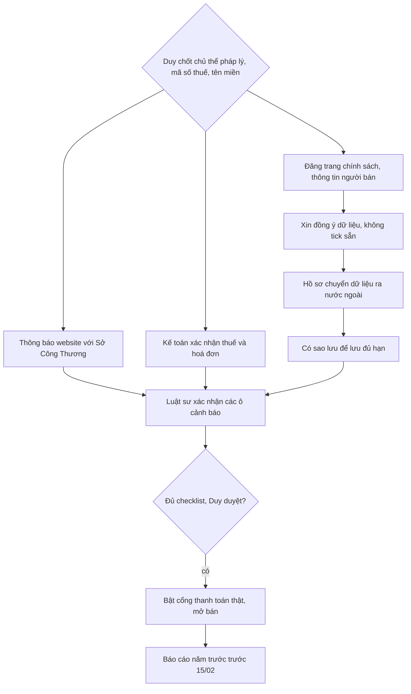

# Checklist pháp lý trước khi go-live website bán hàng

Kiểm chứng ngày 2026-09-27 theo các văn bản đang có hiệu lực:
- **Luật Thương mại điện tử 2025** (122/2025/QH15), hiệu lực từ 01/7/2026.
- **NĐ 248/2026/NĐ-CP**, hướng dẫn Luật TMĐT, hiệu lực từ 01/7/2026. NĐ 52/2013 và NĐ 85/2021 không còn là căn cứ chính.
- **Luật Bảo vệ dữ liệu cá nhân 2025**, hiệu lực từ 01/01/2026.
- **NĐ 117/2025/NĐ-CP** về thuế thương mại điện tử.

Cập nhật 2026-10-11: mục 6, 6b, 7 sửa theo `doc/features/2026-10-06-shop-giao-dien-moi/05-phap-ly.md` mục 8 (P3), kiểm ngày 2026-10-10: **NĐ 356/2025/NĐ-CP** (thay NĐ 13/2023, hiệu lực 01/01/2026), Google Maps vào hồ sơ chuyển dữ liệu ra nước ngoài, **NĐ 254/2026/NĐ-CP** (thay NĐ 123/2020, hiệu lực 01/7/2026) và NĐ 68/2026. Nguồn ở cuối `05-phap-ly.md`.

> Đây là tài liệu tham khảo nội bộ, không phải tư vấn pháp lý. Các ô **⚠** cần luật sư hoặc Sở Công Thương xác nhận trước khi go-live.

**Mô hình của Cá Về:** Cá Về là **nền tảng kinh doanh trực tiếp** có chức năng đặt hàng trực tuyến, tức Lộc tự bán hàng của mình. Cá Về **không phải** sàn trung gian. Vì vậy các nghĩa vụ dành riêng cho sàn không áp dụng, gồm định danh người bán, gỡ tin vi phạm và khấu trừ thuế thay người bán.

## Checklist

| # | Hạng mục | Yêu cầu (đã kiểm chứng) | Căn cứ | Trạng thái Cá Về |
|---|---|---|---|---|
| 1 | Thông báo website | Thông báo trước khi hoạt động. **UBND cấp tỉnh** (Sở Công Thương) xác nhận, không còn là Bộ Công Thương. Nộp qua Hệ thống quản lý hoạt động TMĐT, kết nối Cổng Dịch vụ công quốc gia. Hồ sơ hợp lệ được phản hồi trong khoảng 3 ngày làm việc. ⚠ Xác nhận địa chỉ cổng nộp, vì trước đây là online.gov.vn. | NĐ 248, Đ.24 khoản 4–5, Phụ lục I | ☐ Chưa làm. Cần chủ thể pháp lý (DN hoặc hộ KD), mã số thuế và tên miền riêng. Tên miền `*.web.app` không phù hợp. |
| 2 | Công khai thông tin | Công khai tên, địa chỉ, MST hoặc GCN ĐKDN, SĐT, email của chủ website. Công khai thông tin hàng hoá, chính sách bảo mật, quyền và nghĩa vụ các bên, cơ chế khiếu nại. | NĐ 248, Đ.4–15 | ☐ Shop **chưa có** trang chính sách hay footer thông tin người bán (`frontend/app` chỉ có `shop/`). |
| 3 | Điều kiện giao dịch chung | Công khai chính sách giá, thanh toán, giao hàng, đổi trả và hoàn tiền. Quy chế livestream chỉ cần khi có bán qua livestream, Cá Về chưa có. | Luật TMĐT 2025; NĐ 248 | ☐ Chưa có trang. Nội dung hoàn tiền phải khớp BR hoàn tiền trong `doc/business-process-spec.md`. |
| 4 | Lưu trữ dữ liệu | Lưu **dữ liệu hợp đồng** (đơn hàng) **tối thiểu 3 năm**. Doanh nghiệp siêu nhỏ, khởi nghiệp sáng tạo hoặc hộ kinh doanh được lưu tối thiểu 1 năm. Mức "lưu dữ liệu đăng tải 1 năm" trong checklist gốc là nghĩa vụ của người bán trên **sàn trung gian** (NĐ 248 Đ.18.1.đ), không áp cho Cá Về. ⚠ Chưa kiểm chứng được điều kiện "trong 5 năm đầu" ghi ở checklist gốc. **Chứng từ kế toán** theo Luật Kế toán phải lưu dài hơn, 10 năm với chứng từ ghi sổ. | Luật TMĐT 2025; Luật Kế toán | ◐ Đơn và chứng từ không bị xoá (bất biến dự án). **Supabase Free không tự sao lưu và job `pg_dump` còn nợ** (xem `moi-truong.md`). Phải có backup thì mới bảo đảm được thời hạn lưu. |
| 5 | Báo cáo định kỳ | Báo cáo kết quả năm trước **trước ngày 15/02 hằng năm** qua Hệ thống quản lý TMĐT, theo mẫu 08–11 tuỳ mô hình. | NĐ 248, Đ.22 khoản 1 | ☐ Cần báo cáo doanh số và số đơn theo năm. ERP có thể xuất sẵn. |
| 6 | Bảo vệ dữ liệu cá nhân | Xin đồng ý khi thu thập tên, SĐT và địa chỉ. **Cấm đồng ý mặc định** (ô đồng ý không được tick sẵn); đồng ý phải kiểm chứng được thời điểm và nội dung (lưu phiên bản chính sách theo đơn). Có chính sách xử lý dữ liệu và hồ sơ đánh giá tác động xử lý. Khách có quyền xem, sửa và xoá dữ liệu. **Dữ liệu vị trí xác định qua dịch vụ định vị** và dữ liệu theo dõi hành vi trên mạng là **dữ liệu nhạy cảm**; vì vậy Shop V1 không có nút "Vị trí của tôi" (Duy chốt 10/10). Chính sách quyền riêng tư phải nêu Google Maps (bản đồ ở bước đặt hàng) và tên đơn vị đối soát thanh toán (Duy chốt 10/10: ghi tên SePay ở trang này). **Mức phạt:** mua bán dữ liệu tối đa 10 lần khoản thu; chuyển dữ liệu xuyên biên giới tối đa **5% doanh thu năm trước**; vi phạm khác tối đa **3 tỷ đồng**. Con số "10% doanh thu" trong checklist gốc là **sai**. ⚠ Thời hạn trả lời yêu cầu của chủ thể dữ liệu theo NĐ 356 chưa xác minh bản gốc. | Luật BVDLCN 2025, Đ.8; **NĐ 356/2025/NĐ-CP** (hiệu lực 01/01/2026, thay NĐ 13/2023) | ☐ Shop mới: ô đồng ý không tick sẵn + giữ phiên bản chính sách (lô 3); nội dung chính sách theo `doc/features/2026-10-06-shop-giao-dien-moi/05-phap-ly.md` §1.2(c), `legal-vn` soát bản cuối. *(cập nhật 2026-10-11)* |
| 6b | **Chuyển dữ liệu ra nước ngoài** (checklist gốc bỏ sót) | Cloud Run, bucket ảnh và Supabase đặt ở `asia-southeast1` (**Singapore**). Dữ liệu khách Việt Nam lưu ở nước ngoài bị coi là chuyển xuyên biên giới, nên phải có **hồ sơ đánh giá tác động chuyển dữ liệu ra nước ngoài**, nộp trong 60 ngày từ lần chuyển đầu (Đ.20 k2). **Google Maps** ở bước đặt hàng (chữ khách gõ, vị trí ghim, IP gửi tới Google, máy chủ ở nước ngoài) cũng gộp vào hồ sơ này; ngoại lệ "khách tự chuyển dữ liệu của mình" (Đ.20 k6) là vùng xám, không dựa vào. **Đ.38 (miễn cho DN nhỏ, hộ KD) không nhắc Đ.20**, nên hồ sơ này vẫn phải làm dù Lộc là hộ kinh doanh. Đây là nhóm vi phạm có mức phạt theo % doanh thu. ⚠ Nhờ luật sư xác nhận thủ tục và phạm vi miễn của Đ.38. | Luật BVDLCN 2025 (Đ.20, Đ.38); NĐ 356/2025 | ☐ Chọn một trong hai: lập hồ sơ (Singapore + Google Maps), hoặc chuyển DB sang region hay nhà cung cấp đặt tại Việt Nam (Google Maps vẫn phải nêu). *(cập nhật 2026-10-11)* |
| 7 | Thuế và hoá đơn | NĐ 117/2025 quy định sàn **có chức năng thanh toán** khấu trừ và nộp thuế thay **hộ hoặc cá nhân** bán trên sàn. Cá Về là website riêng của người bán, không phải sàn, nên người bán **tự kê khai và nộp thuế**. **Hoá đơn:** từ 01/7/2026 **NĐ 254/2026/NĐ-CP thay NĐ 123/2020**. Với hàng hoá, thời điểm lập hoá đơn là lúc chuyển giao quyền sở hữu, không phân biệt đã thu tiền hay chưa (với Cá Về thường là lúc giao hàng ⚠); không còn ngưỡng "dưới 200.000đ không phải lập". Nếu Lộc là doanh nghiệp: lập HĐĐT **cho mỗi lần bán**, kể cả khách cá nhân không đòi. Nếu là hộ kinh doanh: doanh thu từ 1 tỷ/năm dùng HĐĐT có mã hoặc khởi tạo từ máy tính tiền (NĐ 68/2026, sửa bởi NĐ 141/2026 ⚠); dưới ngưỡng thì nghĩa vụ chưa xác minh ⚠. Shop **không thu thông tin và không hiển thị** HĐĐT; việc lập hoá đơn do kế toán làm ngoài Shop. **Không** ghi "Cá Về không xuất hoá đơn". ⚠ Xác nhận hình thức pháp lý của Lộc với kế toán. | NĐ 117/2025; **NĐ 254/2026** (thay NĐ 123/2020); NĐ 68/2026; NĐ 141/2026 | ☐ Chưa rõ hình thức pháp lý. ERP đã có `Invoice` nhưng chưa nối hoá đơn điện tử. Nếu phải lập theo từng đơn thì mở lô ERP riêng trước khi bán (gửi tên, địa chỉ khách cho nhà cung cấp HĐĐT là bên thứ ba mới, phải bổ sung chính sách quyền riêng tư). *(cập nhật 2026-10-11)* |
| 8 | Kỹ thuật | Luật TMĐT và NĐ 248 **không quy định cụ thể** TLS hay HSTS. Luật BVDLCN buộc phải có biện pháp kỹ thuật bảo vệ dữ liệu, và HTTPS là mức tối thiểu. **PCI-DSS chỉ áp dụng khi tự xử lý dữ liệu thẻ.** Cá Về chỉ dùng VietQR và trang thanh toán của SePay, nên không cần. | Luật BVDLCN 2025; tiêu chuẩn PCI SSC | ◐ Shop (Firebase) đã có HTTPS và HSTS `preload`, kiểm bằng curl ngày 2026-09-27. API Cloud Run có HTTPS nhưng **không gửi HSTS**, nên thêm `SECURE_HSTS_SECONDS` vào Django. Nếu bật thanh toán thẻ thì chỉ dùng trang hosted của SePay (mức SAQ A). |
| 9 | Trách nhiệm với người tiêu dùng | "Trách nhiệm liên đới" trong Luật TMĐT 2025 chủ yếu áp cho **sàn trung gian**, liên quan đến hàng hoá của người bán trên sàn. Cá Về là người bán trực tiếp nên chịu **trách nhiệm trực tiếp** với người mua về chất lượng, giao hàng và hoàn tiền. Trách nhiệm này có thể nặng hơn liên đới. | Luật TMĐT 2025; Luật Bảo vệ quyền lợi người tiêu dùng 2023 | ◐ Đã có luồng hoàn tiền và AuditLog. Cần kênh tiếp nhận khiếu nại công khai (xem mục 2). |

Ký hiệu: ☐ chưa làm · ◐ làm một phần · ☑ xong.

## So với checklist gốc (Duy gửi 2026-09-27)

- **Đúng:** mục 1 (thẩm quyền đã chuyển về UBND tỉnh), mục 2, mục 3, mục 5 (hạn 15/02), mục 7 (NĐ 117, tự kê khai), mục 8 (PCI chỉ khi xử lý thẻ).
- **Sai hoặc cần sửa:**
  - Phạt dữ liệu cá nhân **không phải 10% doanh thu**. Mức đúng là 5% doanh thu (chuyển xuyên biên giới), 10 lần khoản thu (mua bán dữ liệu), 3 tỷ đồng (vi phạm khác).
  - Mức "lưu dữ liệu đăng tải 1 năm" là nghĩa vụ của người bán trên sàn.
  - HTTPS/TLS 1.2+/HSTS không phải quy định cứng của luật TMĐT.
  - "Trách nhiệm liên đới" là cơ chế cho sàn trung gian.
- **Bỏ sót:** chuyển dữ liệu ra nước ngoài do server đặt ở Singapore (mục 6b), backup phục vụ nghĩa vụ lưu trữ (mục 4), thời hạn lưu chứng từ kế toán, hoá đơn điện tử.

## Nguồn

- [Luật TMĐT 2025, số 122/2025/QH15 (vanban.chinhphu.vn)](https://vanban.chinhphu.vn/?pageid=27160&docid=216503&classid=1&orggroupid=1)
- [NĐ 248/2026/NĐ-CP (luatvietnam)](https://luatvietnam.vn/thuong-mai/nghi-dinh-248-2026-nd-cp-quy-dinh-chi-tiet-luat-thuong-mai-dien-tu-2026-439480-d1.html) · [Thư viện pháp luật](https://thuvienphapluat.vn/van-ban/Thuong-mai/Nghi-dinh-248-2026-ND-CP-huong-dan-Luat-Thuong-mai-dien-tu-713280.aspx) · [Bộ Công Thương phổ biến](https://moit.gov.vn/tin-tuc/bo-cong-thuong-pho-bien-luat-thuong-mai-dien-tu-va-nghi-dinh-so-248-2026-nd-cp.html)
- [Luật BVDLCN 2025, các quy định đáng chú ý (Bộ Công an)](https://mps.gov.vn/chinh-sach-phap-luat/bai-viet/mot-so-quy-dinh-dang-chu-y-trong-luat-bao-ve-du-lieu-ca-nhan-2025-1753847906) · [xaydungchinhsach.chinhphu.vn](https://xaydungchinhsach.chinhphu.vn/nhung-quy-dinh-dang-chu-y-trong-luat-bao-ve-du-lieu-ca-nhan-2025-119251225084154179.htm)
- [NĐ 117/2025/NĐ-CP (vanban.chinhphu.vn)](https://vanban.chinhphu.vn/?pageid=27160&docid=213883)
