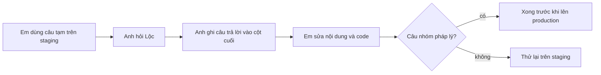

# Câu cần hỏi Lộc (Shop làm lại)
> Tạo 11/10/2026. Em (Claude) đang dùng **câu tạm** dưới đây để làm UAT trên staging. Anh hỏi Lộc xong thì ghi câu trả lời vào cột cuối, em sửa lại nội dung và code.
> Nguồn: `doc/features/2026-10-06-shop-giao-dien-moi/01-analysis.md` §11.1 (S-xx), `06-marketing.md`, `05-phap-ly.md`.

## Giao hàng
| # | Câu hỏi | Đang dùng tạm | Lộc trả lời |
|---|---|---|---|
| L1 | Giao ở đâu: chỉ trong TP Phan Thiết, hay cả các xã/phường lân cận? Ranh giới cụ thể? | "Giao trong khu vực Phan Thiết" | |
| L2 | Đơn có địa chỉ ngoài khu vực thì xử lý sao? | Gọi khách xác nhận; không giao được thì huỷ đơn và trả lại toàn bộ tiền | |
| L3 | Dùng Ahamove hay GHN? Ai đặt chuyến, ai trả cước? | Chưa chốt. Shop ghi "Đã gồm giao hàng. Bạn trả một lần, không trả thêm khi nhận hàng." | |
| L4 | Giao bằng hãng ngoài thì tên, số điện thoại, địa chỉ khách sẽ gửi cho hãng. Lộc có đồng ý không? (phải ghi vào chính sách quyền riêng tư) | Chưa gửi cho hãng nào | |
| L5 | Thường giao trong bao lâu sau khi khách trả tiền? Có giao ngày Chủ nhật, ngày lễ không? | Không hứa thời gian trên Shop | |

## Đơn bị huỷ sau khi khách đã trả tiền
| # | Câu hỏi | Đang dùng tạm | Lộc trả lời |
|---|---|---|---|
| L6 | Trong bao lâu thì Cá Về gọi lại cho khách? | Trong 1 ngày làm việc | |
| L7 | Trong bao lâu thì chuyển trả tiền, chuyển bằng cách nào? | Chuyển khoản về tài khoản khách, trong 3 ngày làm việc | |

## Hàng hoá và câu chữ
| # | Câu hỏi | Đang dùng tạm | Lộc trả lời |
|---|---|---|---|
| L8 | Cá Về có tự làm sạch, cấp đông, hút chân không, đóng thùng giữ lạnh không? Món nào làm, món nào không? | Không nói tới các bước này, chỉ ghi "hàng cấp đông" | |
| L9 | Có dám hứa "cân đúng số kg bạn đặt" không? | Không hứa | |
| L10 | Rã đông bao lâu (một con số dùng chung)? Cách rã đông Lộc khuyên? | "Rã đông trong ngăn mát tủ lạnh khoảng 8–12 giờ" | |
| L11 | Hạn dùng công bố cho khách: chung một hạn hay theo từng lô? | "Hạn dùng ghi theo từng lô" | |
| L12 | Có bán cá nục không? | Chưa đăng bài "cá nục chiên" | |
| L13 | Ảnh thật cho từng món và cho 6 bài Góc bếp | Staging dùng ảnh tạm có nhãn "Ảnh minh hoạ" | |
| L14 | Hotline, Zalo, email, giờ làm việc, địa chỉ kinh doanh | `[placeholder]` | |

## Pháp lý (để sau, trước khi lên production)
| # | Câu hỏi | Đang dùng tạm | Lộc/anh trả lời |
|---|---|---|---|
| L15 | Thông tin doanh nghiệp: tên, mã số thuế, địa chỉ, giấy chứng nhận ĐKKD (nơi cấp, ngày cấp); tên miền riêng | Ẩn khối pháp lý và logo thông báo trên staging | |
| L16 | Kế toán xác nhận nghĩa vụ lập hoá đơn (NĐ 254/2026) | Shop không có ô hoá đơn | |
