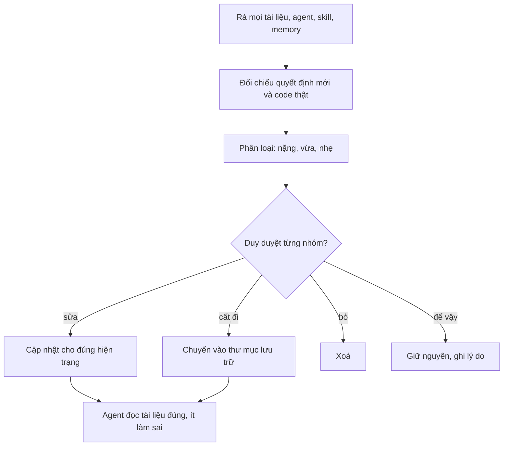

# Rà soát tài liệu lỗi thời (legacy) — 11/10/2026

> Điều phối viên · 2026-10-11 · nhánh `shop/lo-1-khung-chung` · Trạng thái: **ĐÃ DUYỆT, ĐÃ XỬ LÝ 11/10** (Duy: "sửa lại tài liệu legacy đi nhé"; bỏ hẳn Notion). Cột "Đã xử lý" ghi kết quả từng mục; tài liệu cũ dời vào `doc/archive/` (xem `doc/archive/README.md`).
> Phạm vi rà: `CLAUDE.md`, `AGENTS.md`, `README.md`, `DESIGN.md`, `PRODUCT.md`; `.claude/agents`, `.claude/skills` (các skill của dự án), `.claude/commands`; `.agents/`, `.gemini/`; toàn bộ `doc/`; README trong `backend/`, `frontend/`, `erp-console/`, `adapter/` và các module; memory của dự án.
> Đối chiếu với `doc/decisions.md` (nhất là các mục 26/09, 07/10, 08/10, 10/10 tối và 11/10), code thật (ls, grep) và kế hoạch xoá code Shop cũ ở `02b-tech-design.md` §1.11.
> Mức: **Cao** là agent đọc thường xuyên nên dễ làm sai. **Vừa** là sai hiện trạng nhưng ít người đọc. **Thấp** là ghi chú lịch sử, sai trạng thái hoặc sai đường dẫn ở hồ sơ đã đóng.
> Đề xuất: **CẬP NHẬT** · **LƯU TRỮ** (chuyển vào `doc/archive/`, hiện chưa có thư mục này) · **XOÁ** · **GIỮ NGUYÊN** (có lý do).

## Tóm tắt

| Mức | Số mục | Ghi chú |
|---|---|---|
| Cao | 23 | 11 mục là agent, skill hoặc lệnh (§1). Còn lại là các nguồn sự thật (spec, BUILD-PLAN, Bối cảnh decisions), PLAN/PROMPT Shop, enum-map, README Shop, mẫu 02c, memory deploy |
| Vừa | 34 | |
| Thấp | 37 | phần lớn là trạng thái cũ hoặc đường dẫn chết ở hồ sơ đã đóng |
| **Tổng** | **94 mục** | khoảng 140 file, vì nhiều file giống nhau được gộp chung một dòng |

Các lỗi lặp lại nhiều nhất:
1. **Cloud SQL** (đã xoá, nay dùng Supabase, có 2 môi trường) vẫn còn ở skill `feature`, skill `caveve-domain` và memory deploy.
2. **Mô tả Shop cũ**: landing ở `/`, tra đơn bằng 4 số cuối, `sellable_qty`, `CountdownTimer`, `ItemImageFrame`, `SiteLegalFooter`, hướng Linear/Notion. Gặp ở `caveve-ui`, `fe-dev`, `nextjs-shop-patterns`, `frontend/README.md`, `doc/he-thong/frontend.md`, `ecosystem-l1.md`, `enum-map.md`.
3. **"4 Group"** thiếu `customer_service` ở `caveve-domain`, spec, `qa-tester`, `tdd-workflow`.
4. **Dòng trạng thái không đổi khi xong**: khoảng 15 hồ sơ còn ghi "SẴN SÀNG CODE", "CHỜ DUYỆT" hoặc "bản nháp".
5. **Quy trình commit đã cũ**: `git add -A` và `push origin main` sau mỗi lô. Hiện phải commit theo pathspec, và Shop chạy trên nhánh `shop/lo-*` rồi mới gộp vào main.

---

## 1. Agent, skill, lệnh và CLAUDE.md (agent đọc mỗi lượt, nên sửa trước)

| File | Đoạn/dòng | Vì sao lỗi thời (dẫn chứng) | Đề xuất | Mức | Đã xử lý |
|---|---|---|---|---|---|
| `.claude/skills/feature/SKILL.md` | §6 dòng 142–143 | "Cloud Run … Firebase … nhắc chạy migrate trên **Cloud SQL**". Cloud SQL đã xoá, DB nay là Supabase. Từ 27/09 có 2 môi trường và luôn lên staging trước, Duy duyệt rồi mới lên production (`CLAUDE.md` dòng 84, `doc/ops/moi-truong.md`). Skill không nhắc staging. | CẬP NHẬT: trỏ `doc/ops/moi-truong.md`, ghi rõ staging trước rồi production | Cao | ✓ |
| `.claude/skills/feature/SKILL.md` | §4b dòng 126–127 | Dùng `git add -A` và `git push origin main`. Hai chỗ trái hiện trạng: (1) memory `feedback-commit-pathspec` (sự cố 6f1a235) yêu cầu commit theo pathspec; (2) Shop chạy trên nhánh `shop/lo-*`, QA đạt mới gộp main (decisions 11/10, 02b §7.1). `git add -A` còn có thể cuốn theo file không được commit như `doc/ops/notion-map.md`, `sepay.env`, `supabase.env` ở gốc repo, mà repo đang công khai. | CẬP NHẬT: dùng `git add <pathspec>`, push theo nhánh đợt | Cao | ✓ |
| `.claude/skills/caveve-domain/SKILL.md` | dòng 43 (sơ đồ kiến trúc), dòng 109–111 | Ghi "Cloud SQL Postgres 16" (đã xoá, nay Supabase). Mục Production chỉ nói GCP, không có staging. | CẬP NHẬT theo `doc/ops/moi-truong.md` | Cao | ✓ |
| `.claude/skills/caveve-domain/SKILL.md` | dòng 20 (bảng nguồn sự thật) | Lấy `doc/BUILD-PLAN.md` làm "Contract hàm service/API". File này có `allocate_fifo` (code thật là `allocate_fefo`), `nv_kho`, VietQR giả, "models.py đóng băng" (xem §2). | CẬP NHẬT: thay bằng `backend/README.md` và `02b` của hồ sơ tính năng | Cao | ✓ (trỏ `backend/README.md` + 02b) |
| `.claude/skills/caveve-domain/SKILL.md` | bất biến 2 (dòng 63–64) | Ghi "4 Group cộng dồn". Code có 5 nhóm, thêm `customer_service` (`backend/apps/accounts/roles.py:13`, migration 0015). Chính bảng đặt tên trong skill này cũng liệt kê 5. | CẬP NHẬT | Cao | ✓ |
| `.claude/skills/caveve-domain/SKILL.md` | bất biến 9 (dòng 80–81); dòng 47 danh sách app | Bất biến 9 gợi ý "cần hiện thì che bớt `09xx xxx 123`", nhưng quyết định 10/10 là trang đơn công khai **không hiện người nhận**, tra đơn bằng POST với SĐT đầy đủ hoặc mã tra đơn. Skill chưa có các luật Shop mới: mã giảm giá, tồn kho 3 mức, khu vực Phan Thiết, phí giao trả qua QR. Danh sách app thiếu `ai` và `content`. | CẬP NHẬT | Vừa | ✓ (bất biến 9 theo 10/10, thêm mục "Luật Shop mới", app `content` `ai`) |
| `.claude/skills/caveve-ui/SKILL.md` | dòng 3, 8–19, 40 | Ghi "Linear/Notion tinh gọn, **dùng cho cả ba bề mặt**", dark mode ngang hàng, và Shop thì dùng `design-taste-frontend`. Quyết định 10/10 là Shop theo bố cục bán lẻ kiểu Long Châu, làm đúng `doc/design/shop/` (86 màn, `COMPONENTS.md`, `UI-RULES.md`), và "reviewer không chấm lệch Linear/Notion ở Shop". Skill có mục luật ERP nhưng **không có mục Shop**. | CẬP NHẬT: thêm mục "Shop: luật bắt buộc" trỏ tới `doc/design/shop/UI-RULES.md`, `COMPONENTS.md`, `SO-CHUAN.md` | Cao | ✓ (bỏ Linear/Notion; mục Shop + ERP) |
| `.claude/skills/caveve-ui/SKILL.md` | dòng 26 | Trỏ `doc/design/erp/*.dc.html`, nhưng không có file nào ở đó. Thiết kế nằm ở `doc/design/erp/screens/` (105 file). | CẬP NHẬT đường dẫn | Thấp | ✓ |
| `.claude/agents/fe-dev.md` | Cách làm, bước 3 | "Làm UI theo `caveve-ui`: hướng Linear/Notion tinh gọn". Không nhắc `doc/design/shop/`, `COMPONENTS.md` hay quy tắc component trình bày ở 02b §1.10. fe-dev đang làm Shop lô 1–4, nên dễ dựng sai hướng. | CẬP NHẬT: Shop theo `doc/design/shop/`, ERP theo `doc/design/erp/UI-RULES.md` | Cao | ✓ |
| `.claude/skills/nextjs-shop-patterns/SKILL.md` | dòng 20, 33–34, 51–54, 69 | `CountdownTimer` sẽ bị xoá ở lô 3+4 và thay bằng `HoldCountdown` (02b §1.11). Dòng 20 ghi "trang landing là server component, không fetch", nhưng `/gioi-thieu/` đọc CMS. Skill không nhắc cây thư mục Shop mới (`components/ui|catalog|cart|search`, `features/*/…Screen.tsx`). Shop làm lại vẫn trỏ `design-taste-frontend`. | CẬP NHẬT sau lô 1, trỏ 02b §1.1 và §1.10 | Cao | ✓ |
| `.claude/commands/lam-tiep.md` | toàn file | Chỉ chạy đợt ERP theo design (`05-tiep-tuc.md` ngày 03–07/10, `git checkout main`). Đợt đang làm là Shop trên nhánh `shop/lo-*`, nên Duy gõ /lam-tiep sẽ chạy nhầm đợt đã đóng. | CẬP NHẬT: trỏ `02b` §7.1 của Shop, hoặc đổi tên thành `lam-tiep-erp` | Cao | ✓ (trỏ đợt Shop, 02b §7.1) |
| `.claude/skills/requirement-elicitation/SKILL.md` | mẫu `01-analysis` (dòng 36–70), dòng 28 | Mẫu không có khối mermaid dưới tiêu đề, trái luật 11/10 (`CLAUDE.md` dòng 87). Mục "Rủi ro Cá Về" thiếu dữ liệu cá nhân (bất biến 9). Danh sách tác nhân thiếu "Nhân viên gọi xác nhận" (`customer_service`, 08/10). | CẬP NHẬT | Cao | ✓ |
| `.claude/skills/user-story-writing/SKILL.md` | mẫu `02-stories` (dòng 37–58), DoD dòng 33 | Mẫu không có mermaid. DoD chỉ nêu giá vốn, không nêu dữ liệu cá nhân. Danh sách vai thiếu NV gọi xác nhận. | CẬP NHẬT | Cao | ✓ |
| `.claude/skills/feature/SKILL.md` | sơ đồ và §4, §4b, §5 | Thứ tự là QA → commit → techlead review. `CLAUDE.md` (quy trình một lô, bước 4–5) đặt techlead review **trước** QA, rồi mới commit. Có hai quy trình khác nhau. | CẬP NHẬT cho khớp `CLAUDE.md` | Vừa | ✓ (techlead review trước QA, bước 3c) |
| `.claude/skills/feature/SKILL.md` | §2a, §3 | `mkt-brand` chỉ xuất hiện như người viết copy. Quyết định 10/10 cho mkt-brand làm full stack, tự code CMS và trang nội dung. Skill không nhắc phiếu `02c-giao-viec.md` hay bảng lô ở 02b. | CẬP NHẬT | Vừa | ✓ |
| `.claude/agents/qa-tester.md` | Quy trình 1, ca phân quyền | Chỉ liệt kê `owner`/`manager`/`warehouse_staff`/`delivery_staff`, thiếu `customer_service`. | CẬP NHẬT | Vừa | ✓ |
| `.claude/skills/tdd-workflow/SKILL.md` | dòng 47 (cổng kiểm chứng) | Test rò giá vốn chỉ dùng warehouse_staff và delivery_staff, thiếu `customer_service` và thiếu cổng dữ liệu cá nhân. Chưa có bài học "phải thấy dòng `Ran N tests … OK`" (memory `feedback-test-parallel-silent`). | CẬP NHẬT | Vừa | ✓ (+ cổng dữ liệu cá nhân, dòng `Ran N tests … OK`) |
| `.claude/skills/e2e-playwright/SKILL.md` | dòng 13–40 | Ví dụ chỉ có luồng Shop cũ (mở `/shop/`, trong khi `/` đã là trang chủ Shop). Thiếu ERP (cổng 3100) và `/ui-preview/` theo cờ build. "Luôn thử thêm" chưa kiểm dữ liệu cá nhân trong console, localStorage và URL. | CẬP NHẬT | Vừa | ✓ (route mới, ERP :3100, `/ui-preview/`, kiểm dữ liệu cá nhân) |
| `CLAUDE.md` | dòng 77 (bước 6); dòng 37 và sơ đồ dòng 3–25 | Bước 6 ghi `git push origin main` sau mỗi lô, nhưng Shop chạy trên nhánh `shop/lo-*`. Chuỗi ĐẦY ĐỦ và sơ đồ chưa có PM, UX, mkt-brand (dòng 41 có ghi bằng chữ). | CẬP NHẬT | Vừa | ✓ (bước 6 + luật Git; sơ đồ đầu file đã có PM/UX từ trước) |
| Nhánh hiện tại (`CLAUDE.md`, skill `feature`) | — | Commit f8acfb4 (luật Jira PD và `.claude/scripts/jira_pd.py`) có trên `origin/main` nhưng chưa có ở nhánh này, nên agent ở nhánh Shop không biết luật Jira. | CẬP NHẬT: gộp `origin/main` vào nhánh Shop | Vừa | ✓ (đã có: f8acfb4 nằm trong nhánh qua merge a5a5da2) |
| `.claude/skills/django-drf-patterns/SKILL.md` | dòng 62–67 | Có luật test đua trên Postgres nhưng không nói chạy ở đâu. Quyết định 10/10: chạy trên cloud với DB test riêng, không trỏ staging hay production. | CẬP NHẬT 1 dòng | Thấp | ✓ |
| `.claude/agents/mkt-brand.md` | dòng 47 | "Phí giao hàng outscope". Đúng một phần, nhưng thiếu câu đã chốt 10–11/10: khách trả một lần qua QR, hiện chưa có phí ship, dùng câu "Đã gồm giao hàng…", bỏ câu "Phí giao: báo khi xác nhận". QA lô 1 vừa bắt lỗi chữ "Phí giao" trong CMS. | CẬP NHẬT | Thấp | ✓ |
| 6 skill và `AGENTS.md` (mục "Đặt tên P8b") | caveve-domain, tdd-workflow, e2e-playwright, django-drf-patterns, nextjs-shop-patterns, AGENTS.md | Cùng một bảng đặt tên được chép ở 6 nơi (trùng lặp), sửa một nơi là lệch các nơi khác. | CẬP NHẬT: giữ bảng ở `caveve-domain`, các nơi khác chỉ trỏ tới | Thấp | một phần: sửa dòng URL Shop ở 5 skill và ghi "bảng gốc ở `caveve-domain`"; chưa gộp bảng, `AGENTS.md` giữ nguyên (mục 8) |

## 2. Nguồn sự thật nghiệp vụ (`doc/` gốc)

| File | Đoạn/dòng | Vì sao lỗi thời (dẫn chứng) | Đề xuất | Mức | Đã xử lý |
|---|---|---|---|---|---|
| `doc/BUILD-PLAN.md` | toàn file (dòng 5–10, 78, 104, 173, 196) | Hợp đồng Phase 2: `allocate_fifo` (nay là `allocate_fefo`, `inventory/batches/services.py:92`), "`*/models.py` đóng băng" (nay là gói `models/`), `nv_kho`/`nv_giao` (đổi tên 01/10), VietQR giả (đã có cổng SePay 26/09), "Landing + Shop". Skill `caveve-domain` vẫn lấy file này làm contract. | LƯU TRỮ, và gỡ khỏi `caveve-domain` | Cao | ✓ LƯU TRỮ `doc/archive/BUILD-PLAN.md`; để file trỏ ở chỗ cũ vì comment trong code còn nhắc tên |
| `doc/decisions.md` | mục "Bối cảnh", dòng 146 (3 tháng/lô), 150 (Landing tách Shop), 152 (NV nội bộ giao); dòng 95 (FIFO thành phần combo) | Các ý này đã bị thay bởi quyết định 26/09 (FEFO, 365 ngày), 10/10 (`/` là Shop) và 11/10 (Phan Thiết, Ahamove/GHN), nhưng đoạn Bối cảnh không ghi chú "đã thay". Agent đọc Bối cảnh như bản tóm tắt hiện trạng. | GIỮ nội dung (không lật quyết định), thêm chú thích "đã thay bởi mục …" cạnh từng dòng | Cao | ✓ (chỉ thêm chú thích "đã thay", không đổi quyết định) |
| `doc/business-process-spec.md` | dòng 259 (P-02 "hạn = ngày nhập + 90 ngày") | Trái quyết định 26/09: mặc định 365 ngày. | CẬP NHẬT | Cao | ✓ |
| `doc/business-process-spec.md` | dòng 583 "4 Group", §1.3 "bốn nhóm" | Code có 5 nhóm (`customer_service`). | CẬP NHẬT | Cao | ✓ |
| `doc/business-process-spec.md` | BR-GH-01 dòng 431; thiếu BR khu vực giao; thiếu BR-ND-01…17 | "Người giao là NV nội bộ" khác quyết định 11/10 (Phan Thiết, hãng ngoài chưa chốt). Luật CMS BR-ND chỉ có trong hồ sơ `cms-viet-bai`. | CẬP NHẬT (BA làm, hỏi Duy trước khi sửa spec gốc) | Vừa | một phần: thêm lưu ý Phan Thiết cạnh BR-GH-01; BR khu vực giao và BR-ND để BA làm, cần Duy duyệt spec gốc |
| `doc/URD.md` | dòng 69, 126 (90 ngày); 46 (landing + shop tách); 87 (chỉ NV nội bộ); 203 (Celery Beat) | Trái quyết định 26/09, 10/10, 11/10. Job nền chạy bằng Cloud Run Job + Scheduler. | CẬP NHẬT | Vừa | ✓ |
| `doc/thuat-ngu-va-trang-thai.md` | dòng 45 "Ưu đãi = PricingRule, không phải mã giảm giá"; dòng 42 | Từ 10/10 đã có mã giảm giá (Voucher). Tên chuẩn đã duyệt là "Phiếu trừ doanh thu". | CẬP NHẬT | Vừa | ✓ |
| `doc/ecosystem-l1.md` | dòng 10, 54 (node LANDING), 98 | Ghi Landing tách khỏi Shop, tra đơn bằng 4 số cuối. Trái quyết định 10/10. | CẬP NHẬT hoặc LƯU TRỮ | Vừa | ✓ |
| `doc/ke-hoach-tong.md` | toàn file | Bảng P1–P9 dừng ở 01/10, chưa có đợt ERP theo design và Shop. Vẫn nhắc `/lam-tinh-nang` (lệnh của AGY). `doc/he-thong/README.md` vẫn trỏ tới file này. | LƯU TRỮ, hoặc CẬP NHẬT bảng đợt | Vừa | bỏ qua dời: lệnh `/lam-tiep` của AGY còn đọc; đã thêm dòng "ĐÓNG BĂNG 01/10" đầu file |
| `doc/doctype-mapping.md` | toàn file | Chính `decisions.md` đã ghi "⚠ ĐÃ LỖI THỜI" (3 tháng, FIFO). | LƯU TRỮ | Thấp | ✓ LƯU TRỮ `doc/archive/doctype-mapping.md` |
| `doc/so-do-agent.html` + `.workflow.json` | node mkt-brand | Đủ 10 agent và đúng model, nhưng mkt-brand chỉ vẽ ở pha thiết kế, chưa có vai full stack. Hai file này chưa được git theo dõi. | CẬP NHẬT nhỏ, rồi commit hoặc bỏ | Thấp | bỏ qua: file chưa được git theo dõi, không thuộc phạm vi lượt này |

## 3. Thiết kế (`doc/design/`)

| File | Đoạn/dòng | Vì sao lỗi thời (dẫn chứng) | Đề xuất | Mức | Đã xử lý |
|---|---|---|---|---|---|
| `doc/design/shop/PROMPT.md` | dòng 3 (nhánh `design/shop-ui`); dòng 83–87 "Prompt lô 6"; "Chạy lô N trong PLAN.md" | Lô 6 đã xoá, chip "Tìm nhiều" đã bỏ (10/10). Bảng lô chuẩn nay là 02b §7.1 (1-FE, 1-MKT, 1-BE, 2b, 3+4, 5a/5b/5c). Ai dán prompt này sẽ chạy sai lô. | CẬP NHẬT (trỏ 02b §7.1), hoặc LƯU TRỮ | Cao | ✓ (viết lại, trỏ 02b §7.1, bỏ lô 6) |
| `doc/design/shop/PLAN.md` | dòng 2 "NHÁP"; bảng lô dòng 53–64 (lô 0 vẫn ☐) | Lô 0 đã commit (7dfa7aa, 5f193ba, 3aa6731). Bảng lô trùng với 02b §7.1, bản 02b mới hơn. Mermaid không nằm ngay dưới tiêu đề. | CẬP NHẬT: ghi "bảng lô chuẩn ở 02b §7.1" | Cao | ✓ (ĐÃ DUYỆT, lô 0 ☑, lô 1 ☑ a5a5da2, mermaid lên đầu) |
| `doc/design/erp/enum-map.md` | dòng 3, 16, 21, 36 | Trỏ `shared/lib/status.ts` (nay là `enums.ts`) và `cskh/mock.ts` (nay là `confirmation`). Còn dùng PAID (đã bỏ 07/10), "Tự huỷ (quá TTL)" (nay là "Hết giờ giữ chỗ"), phiếu giao "Hoàn tất" (nay là "Đã giao"). QA chấm màn ERP theo file này. | CẬP NHẬT, hoặc trỏ sang `thuat-ngu-va-trang-thai.md` §2–4 | Cao | ✓ |
| `doc/design/shop/DOI-CHIEU-CODE.md` | dòng 30, 53, 155, 216, 301 | Đối chiếu với code cũ ngày 06/10: chip "Tìm nhiều", "Phí giao: báo khi xác nhận". Ghi chú 11/10 ở đầu file chưa nhắc hai chỗ này. | GIỮ làm lịch sử, bổ sung ghi chú đầu file; LƯU TRỮ sau lô 7 | Vừa | ✓ (thêm ghi chú đầu file; lưu trữ sau lô 7) |
| `doc/design/shop/AUDIT-DO-DU.md` | dòng 4–5, 228, 267 | Trỏ `scratchpad/canvas/…`, `wt-shop/…`, `/home/user/fish`, các đường dẫn này không còn. Câu hỏi mở đã được trả lời 10–11/10. | LƯU TRỮ | Thấp | ✓ LƯU TRỮ `doc/archive/design-shop/` |
| `doc/design/shop/RENDER-AUDIT.md` | dòng 6–7, 208 | Thư mục `render-audit/tools/` không có trong repo. Còn câu "Phí giao · Báo khi xác nhận đơn". | LƯU TRỮ | Thấp | ✓ LƯU TRỮ `doc/archive/design-shop/` |
| `doc/design/shop/COMPONENTS.md` | dòng 3 "CHỜ DUYỆT", dòng 7–8 | Decisions 10/10 đã lấy file này làm chuẩn. Các file `CMP-*` mà dòng 7–8 nói "chưa có" thì nay đã có. | CẬP NHẬT dòng trạng thái | Thấp | ✓ |
| `doc/design/shop/README.md`, `PLAN.md`, `PROMPT.md` | đầu file | Không có mermaid ngay dưới tiêu đề (luật 11/10). Riêng UI-RULES, SO-CHUAN, COMPONENTS là luật hoặc số liệu, có thể miễn. | CẬP NHẬT | Thấp | ✓ (README thêm mermaid; PLAN, PROMPT đã có) |
| `doc/design/shop/screens/*.dc.html`, `doc/design/erp/README.md`, `UI-RULES.md` | — | Đã kiểm: chỉ còn các ghi chú dạng "đã bỏ…", không lệch. | GIỮ NGUYÊN | — | giữ nguyên |

## 4. Tài liệu hệ thống và README trong code

| File | Đoạn/dòng | Vì sao lỗi thời (dẫn chứng) | Đề xuất | Mức | Đã xử lý |
|---|---|---|---|---|---|
| `doc/he-thong/frontend.md` | dòng 17–31 (bảng route), 44–46, 69 | Ghi `/` là trang giới thiệu, tra đơn bằng `?phone_last4=`. Liệt kê `CatalogGrid`, `AddToCartControl`, `CountdownTimer` và `ItemImageFrame` (file này đã xoá ở lô 1). Thiếu `/gioi-thieu/`, `/shop/cart/`, `/ui-preview/`. | CẬP NHẬT cuối mỗi lô Shop | Cao | ✓ |
| `frontend/README.md` | toàn file | Ghi "Landing (`/`)". Trỏ `app/shop/[itemCode]/` và `components/QrCode.tsx`, cả hai không còn. Còn `OrderLookup`, "4 số cuối", "VietQR payload giả", và lấy BUILD-PLAN làm contract. | CẬP NHẬT theo 02b §1.1 sau lô 1 | Cao | ✓ |
| `frontend/features/checkout/README.md` | dòng 13–14, 41–55 | Còn `storage.ts` lưu `phone_last4`, GET tra đơn, trạng thái thô `PAID`. Lô 3+4 sẽ xoá. | Thêm 1 dòng "thay ở lô 3+4", viết lại ở lô 3+4 | Cao | ✓ (khối "viết lại ở lô 3+4") |
| `doc/he-thong/nghiep-vu.md` | dòng 13, 53, 59, 97, 113–115, 138 | Còn PAID → PROCESSING, GET `phone_last4`, "Tự huỷ", "chứng từ đảo doanh thu", "CSKH". Trái quyết định 07/10, 08/10, 10/10. | CẬP NHẬT | Vừa | ✓ |
| `doc/he-thong/quy-trinh-doi.md` | dòng 35–45, 96 | Bảng vai thiếu PM, UX, mkt-brand. Ghi `push origin main`, trong khi Shop chạy theo nhánh. | CẬP NHẬT | Vừa | ✓ |
| `doc/he-thong/bang-thuat-ngu.md` | dòng 15, 66, 75 | Dùng tên cũ (CSKH, Tự huỷ, Chứng từ đảo doanh thu), thiếu mã giảm giá. | CẬP NHẬT | Vừa | ✓ |
| `backend/apps/sales/orders/README.md` | dòng 5 | Còn `GET …?phone_last4=`, sẽ thay bằng `POST /api/shop/orders/lookup/` (02b §3.4). | CẬP NHẬT cùng lô 3+4 | Vừa | bỏ qua: thư mục `backend/apps` đang có agent khác sửa; sửa cùng lô 3+4, đã ghi ở `doc/he-thong/backend.md` |
| `backend/README.md` | dòng 71, 155–164 | Ghi job huỷ TTL chạy bằng Celery và Redis. Hạ tầng thật dùng Cloud Run Job + Scheduler (`moi-truong.md` dòng 92). | CẬP NHẬT: ghi Celery chỉ dùng khi dev | Vừa | ✓ |
| `README.md` (gốc) | dòng 33, 110–116 | Mục "Đang làm" chưa có đợt Shop làm lại. Thiếu `doc/design/shop/`. | CẬP NHẬT | Vừa | ✓ |
| `PRODUCT.md` | dòng 31, 46 | Ghi "Shop + Landing" chung, hướng Linear/Notion cho mọi bề mặt. | CẬP NHẬT: thêm ngoại lệ Shop | Vừa | ✓ |
| `DESIGN.md` | dòng 3, 188 | Mô tả toàn hệ là Linear/Notion, dark mode ngang hàng. Ngay trong file, Shop chỉ có bản sáng (dòng 31, 397). | CẬP NHẬT câu mô tả (giữ token) | Thấp | ✓ |
| `doc/he-thong/README.md`, `tong-quan.md`, `backend.md`, `erp-console.md` | dòng 3 | Dấu "cập nhật 02/10, `bf62b81`" đã cũ. | CẬP NHẬT dấu ngày sau khi rà | Thấp | ✓ |
| `erp-console/features/ai/README.md` | dòng 13, 54, 65 | Trỏ `features/ai/commands.ts`. Nay là thư mục `commands/`. | CẬP NHẬT | Thấp | ✓ |
| `frontend/features/catalog/README.md`, `features/home/README.md` | toàn file | Mô tả trước việc của lô 2 và lô 5. Khớp kế hoạch đang chạy. | GIỮ NGUYÊN, cập nhật khi xong lô | Thấp | giữ nguyên (theo đề xuất) |

## 5. Hồ sơ tính năng (`doc/features/`) và `doc/kien-truc/`

| File | Đoạn/dòng | Vì sao lỗi thời (dẫn chứng) | Đề xuất | Mức | Đã xử lý |
|---|---|---|---|---|---|
| `doc/features/_mau-02c-giao-viec.md` | dòng 3 | Ghi "Người hiện thực: Gemini CLI / Antigravity, lệnh `/lam-tinh-nang`". AGY tạm dừng từ 30/09. Mẫu này được chép vào mọi 02c mới. | CẬP NHẬT: đổi thành đội Claude | Cao | ✓ |
| `2026-10-01-erp-theo-design/02c-giao-viec.md` | dòng 47 (lô 17 còn ☐), dòng 2 | Lô 17 đã xong (commit a94472d, 2388b86, đã lên staging 697ced4). Lệnh `/lam-tiep` đọc file này nên có thể chạy lại lô 17. | CẬP NHẬT: đánh ☑, đổi trạng thái thành XONG | Vừa | ✓ (lô 17 ☑, XONG; 2388b86, a94472d, 697ced4) |
| `2026-10-01-erp-theo-design/05-tiep-tuc.md` (+ `06-cho-duy-08-10.md`, `00-can-duy-quyet.md`) | dòng 20 | Ảnh chụp việc dở ngày 07–08/10. Các câu chờ đã được trả lời 08/10 và 10/10. | CẬP NHẬT: ghi "đợt đã đóng", hoặc LƯU TRỮ | Vừa | ✓ (ghi "đợt đã đóng") |
| `doc/kien-truc/de-xuat-cau-truc-lai.md` | dòng 3 "ĐỀ XUẤT, chờ Duy duyệt" | Quyết định 10/10: không cấu trúc lại, giữ làm tham khảo. | CẬP NHẬT dòng trạng thái | Vừa | ✓ |
| `2026-09-26-hop-duy-loc/01-analysis.md` | dòng 2 "CHỜ DUYỆT"; BR-BH-12/13 (dòng 156–157); BR-GH-01/02 | Ghi "miền Nam, 12 tỉnh dưới 300 km", NV nội bộ giao. Quyết định 11/10 là Phan Thiết, hãng ngoài chưa chốt. | CẬP NHẬT: ghi phần đã được 11/10 trả lời, phần còn lại tách hồ sơ hoặc LƯU TRỮ | Vừa | ✓ |
| `2026-09-28-vai-tro-tu-dinh-nghia/01-analysis.md` | dòng 3 "CHỜ DUYỆT" | `ke-hoach-tong.md` ghi "để sau". Hồ sơ đang giữ chỗ mã BR-PQ-20…30. | CẬP NHẬT thành TẠM HOÃN, hoặc LƯU TRỮ | Vừa | ✓ (TẠM HOÃN) |
| `2026-10-06-shop-lien-he/*` | 03-dev-notes | Mô tả `AddToCartControl`, `ContactButton`, `CatalogGrid`, `sellable_qty`. Cả bốn bị xoá ở lô 1–2. | LƯU TRỮ, hoặc thêm dòng "đã thay bởi shop-giao-dien-moi" | Vừa | ✓ (thêm dòng "đã thay") |
| `2026-09-28-khung-go-live/02b, 03, 04` | 02b dòng 30, 43, 67, §5.1 | Mô tả `SiteLegalFooter` gắn ở `app/layout.tsx`. File này đã xoá ở lô 1, footer pháp lý nay là ShopFooter F1/F2. | GIỮ làm lịch sử, thêm ghi chú đầu 02b | Vừa | ✓ (ghi chú đầu 02b) |
| `2026-10-06-shop-giao-dien-moi/00-product-brief.md`, `02a-ux-flow.md`, `06-marketing.md` | dòng trạng thái | Còn "CHỜ DUYỆT", dù Duy đã duyệt 10–11/10 và 02b đã dùng làm nguồn. | CẬP NHẬT thành ĐÃ DUYỆT | Thấp | ✓ (ĐÃ DUYỆT) |
| 6 file 02c (ai-digital-worker, cskh-xac-nhan-in-tem, khung-go-live, cms-viet-bai, sua-loi-review, dat-ten-tieng-anh); 02-stories của luu-cai-dat-ai, pham-vi-du-lieu-khach | dòng 2 "SẴN SÀNG CODE" | Mọi lô đã ☑ và QA APPROVED. | CẬP NHẬT thành XONG | Thấp | ✓ (XONG, đã kiểm lô ☑ và QA APPROVED) |
| `2026-09-26-sepay-cong-thanh-toan/02-stories.md` | dòng 1 "(bản nháp)" | Đã code và QA đạt. Phần FE Shop (màn thành công riêng, tra đơn bằng 4 số cuối) bị thay ngày 10/10. | CẬP NHẬT | Thấp | ✓ |
| `2026-09-30-ai-bat-tat-hai-tang/00-yeu-cau.md`; `2026-09-27-ai-native-erp/01b-performance-analysis.md` | dòng 2 "CHỜ BA", "CHỜ DUYỆT" | AI đã tắt cứng từ 05/10. | CẬP NHẬT thành TẠM HOÃN, hoặc LƯU TRỮ | Thấp | ✓ (TẠM HOÃN) |
| `2026-09-27-tam-tat-thanh-toan/02-stories.md` | TT2 | Đã hoãn, và mô tả banner trên Shop cũ. | LƯU TRỮ | Thấp | ✓ LƯU TRỮ `doc/archive/features/` |
| `2026-10-01-huy-don-dang-giao/01-analysis.md` | dòng 2 "CHỜ DUYỆT" | Việc còn mở thật. | GIỮ NGUYÊN, đưa vào danh sách chờ Duy | Thấp | giữ nguyên (theo đề xuất) |
| `2026-09-30-ra-soat-agy/*`, `2026-09-30-review-p1-p7/*` | toàn hồ sơ | Bản rà soát đã kết thúc. Kịch bản landing ở `/` đã đổi. | LƯU TRỮ | Thấp | bỏ qua dời: test trong `backend/`, `frontend/e2e/`, `erp-console/e2e/` còn trỏ tới; đã thêm dòng "ĐÃ ĐÓNG" đầu file |
| `2026-09-24-erp-console-noi-that/04-qa-report.md` | dòng 3 APPROVED, dòng 198 REJECTED | Hai kết luận trái nhau trong cùng một file. | CẬP NHẬT: thêm dòng "Kết luận hiện hành" ở đầu | Thấp | ✓ (thêm "Kết luận hiện hành: APPROVED") |
| 12 hồ sơ nhắc tra đơn GET `phone_last4` / `OrderLookup`; 6 hồ sơ nhắc `sellable_qty`; `anh-mat-hang` nhắc `ItemImageFrame` | nhiều chỗ | Đây là lịch sử, đúng ở thời điểm viết. Đã bị thay ngày 10/10 hoặc đang bị xoá theo lô. | GIỮ NGUYÊN. Sau lô 3+4, ghi chú đầu `sua-loi-bao-mat/02b` | Thấp | giữ nguyên (theo đề xuất) |
| 16 hồ sơ có 84 đường dẫn code không còn (nhiều nhất: sua-loi-review, cskh-xac-nhan-in-tem, dat-ten-tieng-anh, ai-digital-worker, erp-console-noi-that) | vd `delivery/cskh/**`, `features/cskh/`, `sales/shop_api.py`, `NhapLoForm.tsx`, `QrCode.tsx` | Do đổi tên tiếng Anh ngày 01/10 và chia module. | GIỮ NGUYÊN (hồ sơ đã đóng); lấy đường dẫn từ `backend/README.md` | Thấp | giữ nguyên (theo đề xuất) |
| 8 hồ sơ thời AGY | dòng "Người hiện thực: Gemini/AGY" | Đúng với thời điểm 28–30/09. | GIỮ NGUYÊN | Thấp | giữ nguyên (theo đề xuất) |
| `2026-10-10-tem-4-so-cuoi/*` | — | Vẫn còn hiệu lực (tem in ERP). Tên dễ nhầm với `phone_last4` của Shop. | GIỮ NGUYÊN | Thấp | giữ nguyên (theo đề xuất) |

## 6. Vận hành (`doc/ops/`)

| File | Đoạn/dòng | Vì sao lỗi thời (dẫn chứng) | Đề xuất | Mức | Đã xử lý |
|---|---|---|---|---|---|
| `doc/ops/notion-map.md` | toàn file | Ghi "KHÔNG commit" nhưng file chưa được git theo dõi và chưa có trong `.gitignore`. Skill `feature` dùng `git add -A` nên dễ đẩy nhầm lên repo công khai. Notion cũng đã được Jira PD thay ngày 11/10. | Thêm vào `.gitignore`, hoặc chuyển ra ngoài repo | Vừa | ✓ đã xoá theo Duy (bỏ hẳn Notion, quản lý dự án dùng Jira Product Discovery FISH) |
| `doc/ops/ban-giao-may-moi.md` | dòng 21 | Ghi đang làm "ERP theo design". Hiện đang làm Shop. | CẬP NHẬT | Vừa | ✓ |
| `doc/ops/moi-truong.md` | đầu file | Nội dung đúng. Thiếu mermaid cho luồng deploy (đây là runbook). | CẬP NHẬT: thêm mermaid | Thấp | bỏ qua: đã có mermaid sẵn |
| `doc/ops/cms-cho-mkt.md` | đầu file | Nội dung đúng. Thiếu mermaid cho quy trình soạn → duyệt → đăng. | CẬP NHẬT: thêm mermaid | Thấp | bỏ qua: đã có mermaid sẵn |
| `doc/ops/khao-sat-ben-van-chuyen.md` | dòng 5, 52 | Ghi "không lật 100% nội bộ giao", trong khi 11/10 đã mở hướng Ahamove/GHN. Bảng thiếu GHN. | GIỮ, cập nhật mục đích khi chốt hãng | Thấp | ✓ (thêm dòng 11/10) |
| `doc/ops/postgres-compat-08-10.md` | dòng 3 | Ghi chạy Postgres ở máy cục bộ. Quyết định 10/10 là chạy trên cloud. | GIỮ (nhật ký sự cố), thêm 1 dòng trỏ quyết định 10/10 | Thấp | ✓ |

## 7. AGY (`AGENTS.md`, `.agents/`, `.gemini/`): giữ có chủ ý theo `CLAUDE.md`

| File | Đoạn/dòng | Mâu thuẫn | Đề xuất | Mức | Đã xử lý |
|---|---|---|---|---|---|
| `AGENTS.md` | dòng 10–16, 24–26, 67 | Phân công ngày 28/09, nhánh `wip/autosave`, bảng agent thiếu PM, UX, mkt, techlead, legal. Đầu file đã ghi AGY TẠM DỪNG. | GIỮ, sửa khi bật lại AGY | Thấp | giữ nguyên (mục 8 của việc giao) |
| `.agents/agents/fe-dev.md` (= `.gemini/agents/`) | dòng 3, 21 | Ghi "Shop/Landing", Linear/Notion, không nhắc `doc/design/shop/`. | GIỮ, sửa khi bật lại AGY | Thấp | giữ nguyên (mục 8 của việc giao) |
| `.agents/workflows/lam-tiep.md`, `.gemini/commands/lam-tiep.toml` | dòng 2–12 | Chạy theo `ke-hoach-tong.md` và trùng tên với lệnh `/lam-tiep` của Claude. | GIỮ, đổi tên khi bật lại AGY | Thấp | giữ nguyên (mục 8 của việc giao) |
| `.agents/skills/*` | 14 symlink | Đều trỏ đúng. Chưa link các skill mới, nhưng điều này đúng vì AGY chỉ có BE, FE, QA. | GIỮ NGUYÊN | Thấp | giữ nguyên |

## 8. Memory (chỉ báo, không sửa)

| File | Đoạn | Vì sao sai hiện trạng | Đề xuất | Mức | Đã xử lý |
|---|---|---|---|---|---|
| `memory/cangca-loc-deploy.md` | dòng 85–88, 100–102, 113–115, 141, 178, 185–188 | Ghi "DB → Cloud SQL", "VietQR stub", "Adapter chưa deploy", nhóm `chu`, "4 group". **Dòng 102 có mật khẩu admin dạng chữ thường.** | CẬP NHẬT theo `moi-truong.md`. Xoá mật khẩu ngay và cân nhắc đổi mật khẩu | Cao | bỏ qua: memory ngoài repo — **điều phối cần xoá mật khẩu admin ở dòng 102 và cân nhắc đổi mật khẩu** |
| `memory/MEMORY.md` | dòng 1–3, 6 | Mô tả trong index đã cũ: "roadmap 6 phase, Phase 1 xong", "5 agent", nhóm Opus chỉ gồm "điều phối, BA, PO". | CẬP NHẬT mô tả | Vừa | bỏ qua: memory nằm ngoài repo, việc giao chỉ sửa tài liệu trong repo (điều phối xử lý riêng) |
| `memory/cangca-loc-build-plan.md` | toàn file | Trạng thái 14/09: FIFO, Celery/Redis, VietQR stub, `quan_ly`, 66 test, BUILD-PLAN. | XOÁ, hoặc rút thành 1 dòng trỏ README | Vừa | bỏ qua: memory nằm ngoài repo, việc giao chỉ sửa tài liệu trong repo (điều phối xử lý riêng) |
| `memory/caveve-team-workflow.md` | dòng 203–205, 218 | Ghi "5 subagent + 8 skill", Linear/Notion cho mọi bề mặt, thiếu PM, UX, mkt full stack. | CẬP NHẬT | Vừa | bỏ qua: memory nằm ngoài repo, việc giao chỉ sửa tài liệu trong repo (điều phối xử lý riêng) |
| `memory/feedback-model-split.md` | dòng 364–374 | Đoạn "Lưu ý" dặn truyền `model: "sonnet"`, mâu thuẫn `CLAUDE.md` (không ghi đè model). Thiếu Sonnet 5.5 và thiếu các vai Opus mới. | CẬP NHẬT, bỏ đoạn lưu ý cũ | Vừa | bỏ qua: memory nằm ngoài repo, việc giao chỉ sửa tài liệu trong repo (điều phối xử lý riêng) |
| `memory/feedback-push-per-feature.md` | dòng 389, 400–402 | Dặn "push origin main" sau mỗi lô, và quy ước `wip/autosave`. Shop chạy theo nhánh `shop/lo-*`. | CẬP NHẬT | Thấp | bỏ qua: memory nằm ngoài repo, việc giao chỉ sửa tài liệu trong repo (điều phối xử lý riêng) |
| `memory/project-lam-tiep.md`, `project-chay-het-07-10.md`, `project-shop-nhanh-sau.md` | toàn file | Việc một lần đã xong. | XOÁ hoặc gộp | Thấp | bỏ qua: memory nằm ngoài repo, việc giao chỉ sửa tài liệu trong repo (điều phối xử lý riêng) |
| `memory/project-jira-pd.md` | dòng 471–474 | Đúng trên `origin/main`, nhưng nhánh local chưa có commit f8acfb4. | GIỮ (kèm việc gộp origin/main) | Thấp | bỏ qua: memory nằm ngoài repo, việc giao chỉ sửa tài liệu trong repo (điều phối xử lý riêng) |

---

## Đề xuất xử lý gộp (chờ Duy duyệt)

1. **Sửa ngay (một lô NHANH, không đổi code sản phẩm):** các mục Cao ở §1.
   - Bỏ Cloud SQL, thêm staging ở skill `feature` và `caveve-domain`.
   - Commit theo pathspec và theo nhánh đợt, ở skill `feature`, `CLAUDE.md` và `quy-trinh-doi.md`.
   - Sửa "5 Group" ở `caveve-domain`, `qa-tester`, `tdd-workflow` và spec.
   - Thêm mục Shop vào `caveve-ui` và `fe-dev` (trỏ `doc/design/shop/`).
   - Thêm mermaid, dữ liệu cá nhân và NV gọi xác nhận vào mẫu BA và PO.
   - Trỏ `/lam-tiep` sang đợt Shop.
   - Gộp `origin/main` (Jira) vào nhánh.
2. **Sửa nguồn sự thật (BA làm, Duy duyệt vì đụng spec gốc):**
   - spec và URD: 365 ngày, 5 nhóm, khu vực Phan Thiết, BR-ND.
   - Chú thích "đã thay" trong đoạn Bối cảnh của `decisions.md`.
   - `thuat-ngu-va-trang-thai.md`: mã giảm giá.
   - `enum-map.md`.
3. **Cập nhật theo lô Shop**, mỗi lô xong thì sửa cùng commit: `doc/he-thong/frontend.md`, `nghiep-vu.md`, `frontend/README.md`, README checkout và `sales/orders`, skill `nextjs-shop-patterns`, `e2e-playwright`.
4. **LƯU TRỮ vào `doc/archive/`** (tạo mới):
   - `BUILD-PLAN.md`, `doctype-mapping.md`, `ke-hoach-tong.md`;
   - `doc/design/shop/AUDIT-DO-DU.md`, `RENDER-AUDIT.md`, và `PROMPT.md` nếu không sửa;
   - hồ sơ `ra-soat-agy`, `review-p1-p7`, `tam-tat-thanh-toan`;
   - `DOI-CHIEU-CODE.md` sau lô 7.
5. **Sửa dòng trạng thái** của khoảng 15 hồ sơ (XONG, ĐÃ DUYỆT, TẠM HOÃN). Việc này nhanh và máy móc, điều phối viên có thể làm một lượt.
6. **Bảo mật:** thêm `doc/ops/notion-map.md` vào `.gitignore`. Xoá mật khẩu admin khỏi memory deploy và cân nhắc đổi mật khẩu. Bỏ `git add -A`.
7. **Giữ nguyên:** `AGENTS.md`, `.agents/`, `.gemini/` (để bật lại AGY), hồ sơ đã đóng có đường dẫn cũ, và hồ sơ thời AGY. Đó là lịch sử, chỉ không dùng làm nguồn đường dẫn.
