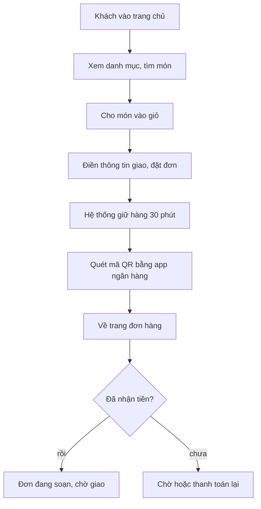

# Cá Về — Shop cho khách (`frontend/`)



Shop bán lẻ của Cá Về, đang **làm lại từ đầu** theo thiết kế `doc/design/shop/` (quyết định 10/10/2026).
Hồ sơ đợt: `doc/features/2026-10-06-shop-giao-dien-moi/`. Cây thư mục, contract API và bảng lô chuẩn nằm ở
`02b-tech-design.md` của hồ sơ đó (§1.1 cây thư mục, §1.10 component, §1.11 code cũ bị xoá theo lô, §3 contract,
§7.1 bảng lô). Code cũ được xoá dần theo lô, không vá. README này mô tả hiện trạng sau Shop lô 1.

Next.js 14 (App Router), **xuất tĩnh** ra `out/`, đưa lên Firebase Hosting. Khách không đăng nhập (guest checkout,
gộp theo SĐT). Mọi dữ liệu đọc từ API công khai của Django lúc chạy.

## Trang

| URL | Nội dung |
|---|---|
| `/` | Trang chủ Shop (`features/home/components/HomeScreen.tsx`) |
| `/shop/` | Danh mục theo nhóm (lô 2 thay bằng `CatalogScreen`) |
| `/shop/item/?code=<mã hàng>` | Chi tiết món hoặc combo |
| `/shop/cart/` | Giỏ hàng (✚ lô 2) |
| `/shop/checkout/` | Đặt đơn và thanh toán (viết lại ở lô 3+4) |
| `/shop/orders/?code=…` | Trang đơn hàng, cũng là trang tra đơn |
| `/about/` | Trang giới thiệu thương hiệu (nội dung từ CMS) |
| `/blog/` | Bài viết, Góc bếp (`?slug=` cho chi tiết) |
| `/pages/?slug=…` | Trang CMS: chính sách, liên hệ, cách mua |
| `/ui-preview/` | Bộ sưu tập component, **chỉ có** khi build với `NEXT_PUBLIC_UI_PREVIEW=1` (production trả 404) |

URL và tên thư mục là tiếng Anh (quyết định 11/10). Slug nội dung CMS (vd `cach-mua-hang`) là dữ liệu, giữ tiếng Việt.
Route chi tiết dùng query string thay route động vì xuất tĩnh không dựng trước được trang cho mã chưa biết.

## Cấu trúc thư mục

```
frontend/
  app/                 route: page.tsx, layout.tsx (CartProvider + ToastProvider ở root), globals.css (token),
                       legacy.css (class cũ, xoá ở lô 5), about/, blog/, pages/, shop/, ui-preview/
  components/
    ShopFrame.tsx      khung trang: header + main + footer + BottomNav, mỗi màn tự bọc
    ShopHeader, ShopFooter, BottomNav, LogoSlot, CartContext, shopLinks.ts
    ui/                component trình bày dùng chung (Button, Chip, Dialog, Sheet, Toast, Icon…)
    catalog/           PriceTag, ImageFrame, CategoryTile, ProductCard, StockBadge
    search/            SearchBox
    cart/              (✚ lô 2)
  features/            home/, catalog/, checkout/, content/ (mkt-brand), site/ (mkt-brand), ui-preview/
  lib/                 api.ts (MỌI gọi Shop API đi qua đây), mock.ts, types.ts, format.ts, quantity.ts, phone.ts
  scripts/             check-no-mock.mjs, test-format.mjs, test-quantity.mjs, test-phone.mjs, test-safe-href.mjs
  e2e/                 kịch bản Playwright (Python)
```

Component trong `components/ui|catalog|cart|search` chỉ **trình bày**: props vào, callback ra, không gọi API, không
đọc storage. Chỉ `*Screen.tsx`, `ShopHeader` và `ShopFooter` được gọi API. Token màu và chữ lấy từ `DESIGN.md` ở gốc repo.

Còn tồn tại nhưng sẽ xoá theo 02b §1.11: `CountdownTimer`, `app/shop/orders/OrderLookup.tsx`, `features/checkout/storage.ts`, `PaymentPanel`,
`OrderPaymentPanel` (lô 3+4); `legacy.css`, `features/home/content.ts` (lô 5).

## API chính

- `GET /api/shop/catalog/` trả `{groups, items}`. Mỗi món có `stock_level` (`in` / `low` / `out`, Shop hiện ba mức
  Còn hàng / Sắp hết / Hết), không có số kg tồn, giá vốn hay mã lô.
- `GET /api/shop/catalog/<item_code>/`: chi tiết món.
- `POST /api/shop/orders/`: đặt đơn, trả mã đơn và `booked_expires_at`.
- `POST /api/shop/orders/<code>/checkout/`: lập tham số cổng thanh toán (xem `features/checkout/README.md`).
- Tra đơn: hiện còn `GET /api/shop/orders/<code>/?phone_last4=`; **lô 3+4 đổi sang
  `POST /api/shop/orders/lookup/`** (mã đơn + SĐT đầy đủ, hoặc mã tra đơn) và gỡ đường GET.

## Chạy

```bash
cd frontend
npm ci
NEXT_PUBLIC_USE_MOCK=1 npm run dev                         # mock, không cần backend -> http://localhost:3000
NEXT_PUBLIC_USE_MOCK=0 NEXT_PUBLIC_API_BASE=http://localhost:8000 npm run dev
NEXT_PUBLIC_USE_MOCK=0 npm run build                       # build tĩnh ra out/, phải sạch
node scripts/test-format.mjs && node scripts/test-quantity.mjs
```

`.env.example` bật mock. Build để deploy luôn truyền `NEXT_PUBLIC_*` **trực tiếp** trên dòng lệnh vì `.env.local`
đè lên `.env.production`, rồi chạy `node scripts/check-no-mock.mjs out`. Shop là web tĩnh, không dùng `next start`.
URL API từng môi trường và lệnh deploy: `doc/ops/moi-truong.md`.

## Luật nghiệp vụ cần nhớ

- Bán theo kg, tối thiểu 1 kg; combo tính theo combo, số nguyên.
- Hiện chưa có phí ship; khách trả một lần qua QR. Không hứa "miễn phí giao".
- Trang đơn hàng công khai **không hiện người nhận** (tên, SĐT, địa chỉ). Không lưu dữ liệu cá nhân vào
  `localStorage` hay URL (bất biến 9, skill `caveve-domain`).
- Contract hàm service/API: `backend/README.md` và 02b của hồ sơ tính năng đang làm.
