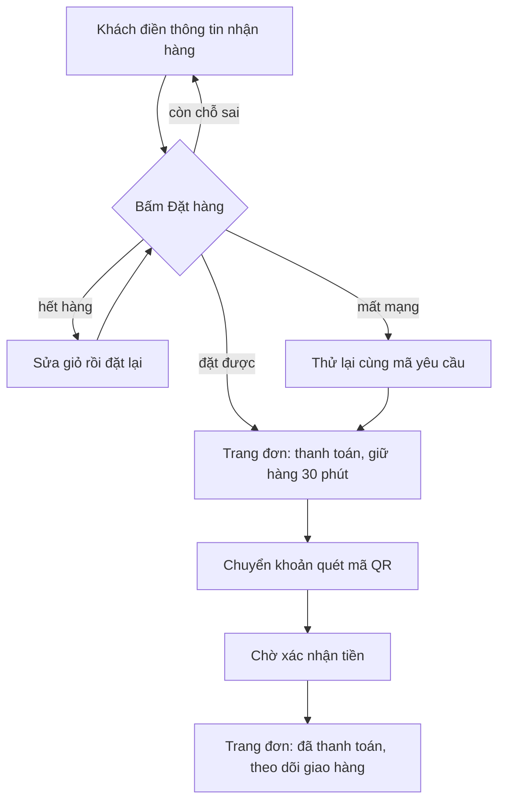

# features/checkout

Đặt hàng, thanh toán và trang đơn (cũng là trang tra cứu) của Shop, Shop lô 3+4
(`doc/features/2026-10-06-shop-giao-dien-moi/02b-tech-design.md` §1, §3.3–3.5, §6).

## Nội dung

- `components/CheckoutScreen.tsx` — `/shop/checkout/`: form nhận hàng, ô đồng ý (không tick sẵn), bản đồ, gửi đơn,
  các hộp thoại C3 (hết hàng), C4 (mất mạng), C5 (bản đồ lỗi), C8 (429), C9 (chính sách đổi), X2 (Shop tạm ngưng).
- `components/OrderScreen.tsx` — `/shop/orders/?code=&result=`: tra cứu (F1/F2) và mọi màn đơn. Chọn màn bằng `orderState.ts`.
  Màn con: `PaymentView` (D1, D2, nền D4), `PendingView` (D3), `ExpiredView` (D4 trang), `OrderView` (E1–E5), `LookupForm`.
- `orderState.ts` — `screenFor(order, result, clock)`: trạng thái máy chủ + `result` URL → màn; đồng hồ giữ hàng; dòng thời gian.
- `formRules.ts`, `reorder.ts` — luật form, dựng lại giỏ ("Đặt lại", "Mua lại"). Thuần TypeScript, có test.
- `requestId.ts` — `client_request_id` (sessionStorage, kèm vân tay giỏ) để không tạo đơn trùng.
- `lookupToken.ts` — mã tra đơn trong sessionStorage (`cangcaloc_order_tokens_v1`), không bao giờ trên URL.
- `googleMaps.ts` — nạp Google Maps chỉ khi bấm "Bản đồ"; thiếu `NEXT_PUBLIC_GOOGLE_MAPS_KEY` thì mở thẳng C5, không request.
- `gateway.ts` — chuyển sang cổng thanh toán (`fields` giữ nguyên thứ tự, BR-TT-13). `MockGatewayPanel` chỉ có ở mock.

## Quy tắc

- Không lưu tên, SĐT, địa chỉ vào storage, URL hay console. SĐT khách gõ ở form tra đơn bị bỏ ngay khi tra xong.
- Trang đơn công khai không hiện người nhận. Không chữ "hoàn tiền", không tên cổng thanh toán, không nút "Huỷ đơn".
- Gọi API qua `lib/api.ts` (`createOrder`, `lookupOrder`, `startCheckoutSession`) kèm nhánh mock trong `lib/mock.ts`.
