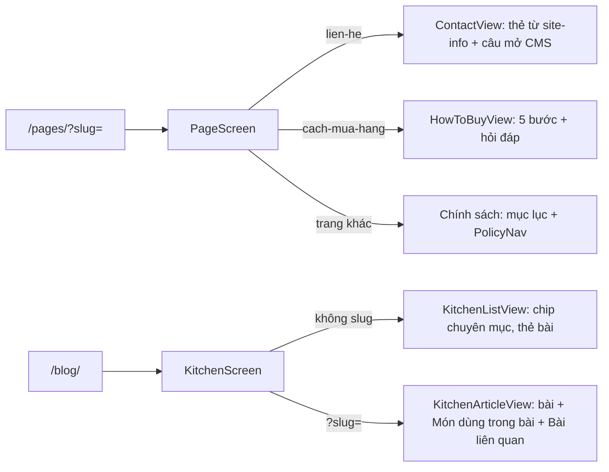

# features/content: trang nội dung CMS trên Shop (mkt-brand)

| File | Việc |
|---|---|
| `api.ts` | Gọi API công khai `/api/public/content/*` (mock nạp động khi `NEXT_PUBLIC_USE_MOCK=1`) |
| `mock.ts` | Dữ liệu mock, sinh từ `backend/apps/content/management/shop_content/*.json` |
| `types.ts` | Kiểu JSON trang/bài/khối thân bài |
| `slugs.ts` | Slug trang cố định (`lien-he`, `cach-mua-hang`, `giao-hang`, `doi-tra`) và đường dẫn `/pages/`, `/blog/` |
| `headings.ts` | `id` cho tiêu đề cấp 2 + mục lục (dùng chung cho thân bài và PolicyNav) |
| `pageMeta.ts` | Tiêu đề tab, `robots noindex`, mô tả trang (static export không có metadata theo slug) |
| `policySummary.ts` | Tóm tắt trang `giao-hang`, `doi-tra` cho trang chi tiết món (SHOP-5-04 AC5) |
| `safeHref.ts` | Chặn link độc trong thân bài (SR-24 F9) |
| `components/ArticleBody.tsx` | Vẽ khối thân bài (không vẽ `item_card`) |
| `components/ArticleItems.tsx` | "Món dùng trong bài": ProductCard `row` + AddToCart (thay ItemCard cũ) |
| `components/ContentState.tsx` | Khung xương + 3 trạng thái lỗi (404, 410, lỗi mạng) theo 06-marketing C7 |
| `components/PageScreen.tsx`, `ContactView.tsx`, `HowToBuyView.tsx` | Màn `/pages/` (SHOP-5-04) |
| `components/KitchenScreen.tsx`, `KitchenListView.tsx`, `KitchenArticleView.tsx` | Màn `/blog/` (SHOP-5-05) |

PolicyNav (COMPONENTS #36) ở `features/site/components/PolicyNav.tsx`. Chữ nội dung nằm ở CMS; ở đây chỉ chữ giao diện.
